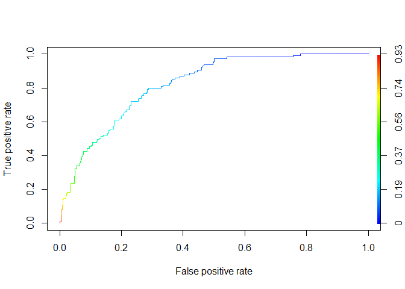

Creating Model for Training Data
================
Angela Zhao
2020-10-27

  - [Reading and cleaning Data](#reading-and-cleaning-data)
  - [Normalize the preferences, if out of 100, to percentages
    instead.](#normalize-the-preferences-if-out-of-100-to-percentages-instead.)
  - [Choosing Variables](#choosing-variables)
  - [Rescaling 1-10 scale to 0-1
    scale](#rescaling-1-10-scale-to-0-1-scale)
  - [Checking for correlations](#checking-for-correlations)
  - [Create a train and a validate
    set](#create-a-train-and-a-validate-set)
  - [Using lasso to weed out extraneous
    vars](#using-lasso-to-weed-out-extraneous-vars)
  - [Data used](#data-used)
  - [Functions](#functions)
      - [Accuracy](#accuracy)
      - [Precision and](#precision-and)
  - [Linear Regression](#linear-regression)
      - [With all lasso covariates](#with-all-lasso-covariates)
  - [ROC curve](#roc-curve)
      - [Creating a model with interaction
        terms](#creating-a-model-with-interaction-terms)
      - [Stepwise AIC regression on model
        2](#stepwise-aic-regression-on-model-2)

``` r
# Libraries
library(tidyverse)
library(here)
library(cvTools)
library(coefplot)
library(glmnet)
library(GGally)
library(ROCR)

file_raw_train_data <-
  here("data/train_data_speed_dating.csv")

recode_race <-
  c(
    "1" = "Black", 
    "2" = "White", 
    "3" = "Hispanic", 
    "4" = "API", 
    "5" = "Indigenous",
    "6" = "Other"
  )
  

recode_goal <-
  c(
    "1" = 'Seemed like a fun night out',   
    "2" = "To meet new people",
    "3" = "To get a date", 
    "4" = "Looking for a serious relationship",
    "5" = "To say I did it",
    "6" = "Other"
  )


recode_date <- c(
  "1" = 'Several times a week',   
  "2" = "Twice a week",
  "3" = "Once a week", 
  "4" = "Twice a month",
  "5" = "Once a month",
  "6" = "Several times a year",
  "7" = "Almost never"
)


recode_go_out <-
  c(
    "1" = 'Several times a week',   
    "2" = "Twice a week",
    "3" = "Once a week", 
    "4" = "Twice a month",
    "5" = "Once a month",
    "6" = "Several times a year",
    "7" = "Almost never"
    
  )
```

## Reading and cleaning Data

``` r
train <-
  file_raw_train_data %>% 
  read_csv()
```

    ## 
    ## -- Column specification --------------------------------------------------------
    ## cols(
    ##   .default = col_double(),
    ##   positin1 = col_logical(),
    ##   field = col_character(),
    ##   undergra = col_logical(),
    ##   mn_sat = col_logical(),
    ##   tuition = col_logical(),
    ##   from = col_character(),
    ##   career = col_character(),
    ##   attr4_1 = col_logical(),
    ##   sinc4_1 = col_logical(),
    ##   intel4_1 = col_logical(),
    ##   fun4_1 = col_logical(),
    ##   amb4_1 = col_logical(),
    ##   shar4_1 = col_logical(),
    ##   attr5_1 = col_logical(),
    ##   sinc5_1 = col_logical(),
    ##   intel5_1 = col_logical(),
    ##   fun5_1 = col_logical(),
    ##   amb5_1 = col_logical(),
    ##   attr1_s = col_logical(),
    ##   sinc1_s = col_logical()
    ##   # ... with 56 more columns
    ## )
    ## i Use `spec()` for the full column specifications.

``` r
# Added in the ratings of partner rating you and you rating the partner
# diff is the avg of partner rating you - avg of you rating the partner

train <-
  train %>% 
  mutate_at(
    vars(
      career_c, 
      field_cd,
      race,
      race_o,
      zipcode,
      go_out,
      date,
      goal,
      met,
      met_o,
      samerace,
      gender,
      match
    ), 
    as.character
  ) %>% 
  mutate(
    field_cd = 
      case_when(
        field_cd %in% c("2", "4", "5", "10") ~ "STEM", 
        field_cd %in% c("1", "3", "8", "9", "11", "13") ~ "Social_Science",
        field_cd %in% c("6", "7", "14", "15", "16", "17") ~ "Humanities",
        TRUE ~ "Other"
      ), 
    race = recode(race, !!! recode_race), 
    goal = recode(goal, !!! recode_goal),
    met = if_else(met == "2", "0", met), 
    met_o = if_else(met_o == "2", "0", met_o),
    race_o = recode(race_o, !!! recode_race), 
    gender = if_else(gender == "0", "female", "male"),
    career_c = 
      case_when(
        career_c %in% c("3", "4", "5") ~ "STEM", 
        career_c %in% c("1", "7", "8", "9", "10", "11", "12", "13", "17") ~ "Social_Science",
        career_c %in% c("6") ~ "Humanities",
        TRUE ~ "Other"
      )
  ) %>%
  mutate_at(
    vars(
      career_c,
      field_cd,
      race,
      race_o,
      goal,
      met,
      met_o,
      gender
    ),
    as.factor
  )
```

## Normalize the preferences, if out of 100, to percentages instead.

``` r
train <-
  train %>% 
  rowwise() %>% 
  mutate(
    sum_2_1 = sum(c(attr2_1, sinc2_1, intel2_1, fun2_1, amb2_1, shar2_1)), 
    sum_4_1 = sum(c(attr4_1, sinc4_1, intel4_1, fun4_1, amb4_1, shar4_1)),
  ) %>%
  mutate_at(
    vars(attr2_1, sinc2_1, intel2_1, fun2_1, amb2_1, shar2_1), 
    ~ . / sum_2_1
  ) %>%
  mutate_at(
    vars(attr4_1, sinc4_1, intel4_1, fun4_1, amb4_1, shar4_1), 
    ~ . / sum_4_1
  ) %>%
  dplyr::select(-c(sum_2_1, sum_4_1))

train <-
  train %>% 
  rowwise() %>% 
  mutate(
    rating = sum(c(attr, sinc, intel, fun, amb, shar)), 
    avg_partner_rating = 
      mean(c(attr, sinc, intel, fun, amb, shar), na.rm = TRUE) / 10
  ) %>%
  mutate_at(
    vars(attr, sinc, intel, fun, amb, shar), 
    ~ . / rating
  ) %>% 
  select(-rating)
```

## Choosing Variables

``` r
# Selecting only the variables that determine perception of the round of speed

# Field and career are too unevenly entered, so best to use the coded versions instead. 

vars_wanted <-
  train %>% 
  select(
    rowname, 
    gender, 
    condtn, 
    match:race_o,
    like_o:age, 
    field_cd, 
    race:imprelig, 
    goal:go_out, 
    career_c:exphappy, 
    dec:met, 
    avg_partner_rating
  ) %>%
  select(-c(met, met_o, dec)) %>% 
  summarize_all(~ sum(is.na(.))) %>% 
  summarize_all(~ sum(.)) %>% 
  mutate_all(~ . / 4258) %>% 
  pivot_longer(
    cols = everything(), 
    names_to = "var", 
    values_to = "percent_missing"
  ) %>% 
  filter(percent_missing < 0.5) 

vars_wanted <-
  vars_wanted %>% 
  arrange(desc(percent_missing)) %>% 
  filter(var != "income") %>% 
  pull(var)

all_training_data <-
  train %>% 
  select(rowname, all_of(vars_wanted))
```

## Rescaling 1-10 scale to 0-1 scale

``` r
all_training_data <-
  all_training_data %>% 
  mutate_at(
    vars(prob, prob_o, like, like_o, imprace, imprelig, sports:exphappy), 
    ~ . / 10
  ) %>% 
  mutate(
    match = as.double(match)
  ) 


cor_data <-
  all_training_data %>% 
  drop_na()
```

## Checking for correlations

``` r
# Convert data to numeric
corr <- 
  cor_data %>% 
  mutate_all(as.integer)

# ggcorr(corr,
#     method = c("pairwise", "spearman"),
#     nbreaks = 6,
#     hjust = 0.8,
#     label = TRUE,
#     label_size = 3,
#     color = "grey50")
```

## Create a train and a validate set

``` r
random_rows <-
  all_training_data %>%
  pull(rowname) %>% 
  as_tibble %>% 
  sample_frac(0.8) %>% 
  mutate(
    value = as.character(value)
  ) %>% 
  pull(value)

train_model_data <-
  all_training_data %>%
  as_tibble() %>% 
  filter(rowname %in% random_rows)

test_model_data <-
  all_training_data %>%
  anti_join(train_model_data, by = "rowname") %>% 
  select(-rowname) 


lasso_model_data <- 
  train_model_data %>% 
  select(-rowname) %>% 
  mutate_at(vars(condtn), as.factor) %>%
  drop_na()
```

## Using lasso to weed out extraneous vars

``` r
# convert the data to a design matrix
X = model.matrix(match ~ 0 + ., lasso_model_data)
Y = lasso_model_data %>% pull(match)


# standardize
X = scale(X)
Y = scale(Y)

set.seed(1244)

# create training and test set
train.ind = sample(nrow(X), round(nrow(X)/2))
X.train = X[train.ind,]
X.test = X[-train.ind,]
Y.train = Y[train.ind]
Y.test = Y[-train.ind]

# set lambda sequence to use for lasso and ridge
lambdas = 10^seq(-2,1.5,0.1)

#lasso
fm.lasso = glmnet(X.train, Y.train, alpha = 1, lambda = lambdas, thresh = 1e-12)

fm.lasso %>%
  summary()
```

    ##           Length Class     Mode   
    ## a0          36   -none-    numeric
    ## beta      2484   dgCMatrix S4     
    ## df          36   -none-    numeric
    ## dim          2   -none-    numeric
    ## lambda      36   -none-    numeric
    ## dev.ratio   36   -none-    numeric
    ## nulldev      1   -none-    numeric
    ## npasses      1   -none-    numeric
    ## jerr         1   -none-    numeric
    ## offset       1   -none-    logical
    ## call         6   -none-    call   
    ## nobs         1   -none-    numeric

``` r
cv <- cv.glmnet(X.train, Y.train)

cv$lambda.min
```

    ## [1] 0.02376413

``` r
covars_wanted <-
  extract.coef(cv) %>%
  select(coeff = Coefficient) %>%
  filter(coeff != "(Intercept)") %>%
  pull(coeff)


covars_wanted <-
  covars_wanted %>%
  as_tibble() %>%
  filter(value %in% colnames(train)) %>%
  pull(value)

covars_wanted
```

    ##  [1] "attr"               "sinc"               "fun"               
    ##  [4] "amb"                "prob"               "prob_o"            
    ##  [7] "like"               "like_o"             "avg_partner_rating"
    ## [10] "imprace"            "tvsports"           "gaming"            
    ## [13] "theater"            "shopping"           "age"

``` r
# train_model_data <-
#   train_model_data %>% 
#   select(match, all_of(covars_wanted))
```

## Data used

``` r
# Add in field_cd and career_c b/c rep as factors in covars_wanted
train_model_data <-
  train_model_data %>%
  select(match, attr, sinc, fun, prob, prob_o, like, like_o, avg_partner_rating, imprace, tvsports, clubbing, movies, shopping, age_o)
```

## Functions

### Accuracy

``` r
accuracy <- function(table_mat) {
  sum(diag(table_mat)) / sum(table_mat)
}
```

### Precision and

``` r
precision <- function(matrix) {

    tp <- matrix[2, 2]
    
    fp <- matrix[1, 2]
    return(tp / (tp + fp))
}

recall <- function(matrix) {
    tp <- matrix[2, 2]
    fn <- matrix[2, 1]
    return(tp / (tp + fn))
}
```

## Linear Regression

### With all lasso covariates

``` r
m1 <-
  glm(
    match ~ ., 
    data = train_model_data, 
    family = 'binomial'
  ) 


predict <- predict(m1, test_model_data, type = 'response')
# confusion matrix
table_mat <- table(test_model_data$match, predict > 0.5)
table_mat
```

    ##    
    ##     FALSE TRUE
    ##   0   544   27
    ##   1    85   30

``` r
accuracy(table_mat)
```

    ## [1] 0.8367347

``` r
precision(table_mat)
```

    ## [1] 0.5263158

``` r
recall(table_mat)
```

    ## [1] 0.2608696

# ROC curve

``` r
index <-
  predict[!is.na(predict)] %>% 
  as.data.frame() %>% 
  add_rownames() %>% 
  pull(rowname)
```

    ## Warning: `add_rownames()` is deprecated as of dplyr 1.0.0.
    ## Please use `tibble::rownames_to_column()` instead.
    ## This warning is displayed once every 8 hours.
    ## Call `lifecycle::last_warnings()` to see where this warning was generated.

``` r
t <-
  test_model_data %>% 
  add_rownames() %>% 
  filter(rowname %in% index)


ROCRpred <- prediction(predict[!is.na(predict)], t$match)
ROCRperf <- performance(ROCRpred, 'tpr', 'fpr')
plot(ROCRperf, colorize = TRUE, text.adj = c(-0.2, 1.7))
```

<!-- -->

## Creating a model with interaction terms

``` r
m2 <-
  glm(
    match ~ . + like:avg_partner_rating + attr:like_o, 
    data = train_model_data, 
    family = 'binomial'
  ) 

m2 %>% 
  summary()
```

    ## 
    ## Call:
    ## glm(formula = match ~ . + like:avg_partner_rating + attr:like_o, 
    ##     family = "binomial", data = train_model_data)
    ## 
    ## Deviance Residuals: 
    ##     Min       1Q   Median       3Q      Max  
    ## -2.1325  -0.5732  -0.2816  -0.0755   3.4034  
    ## 
    ## Coefficients:
    ##                          Estimate Std. Error z value Pr(>|z|)    
    ## (Intercept)             -14.47873    2.39441  -6.047 1.48e-09 ***
    ## attr                    -18.12121    8.85016  -2.048 0.040603 *  
    ## sinc                     -3.63522    2.45122  -1.483 0.138068    
    ## fun                       4.77242    2.55402   1.869 0.061680 .  
    ## prob                      1.69865    0.35527   4.781 1.74e-06 ***
    ## prob_o                    1.05987    0.31877   3.325 0.000884 ***
    ## like                     14.07004    2.42749   5.796 6.79e-09 ***
    ## like_o                   -0.71671    2.01142  -0.356 0.721598    
    ## avg_partner_rating       12.64879    2.54879   4.963 6.95e-07 ***
    ## imprace                  -0.64568    0.22647  -2.851 0.004357 ** 
    ## tvsports                 -0.61504    0.22987  -2.676 0.007459 ** 
    ## clubbing                  0.49979    0.25313   1.974 0.048335 *  
    ## movies                   -0.61452    0.36023  -1.706 0.088030 .  
    ## shopping                 -0.24461    0.24865  -0.984 0.325238    
    ## age_o                     0.01495    0.01854   0.806 0.420067    
    ## like:avg_partner_rating -14.88181    3.25875  -4.567 4.95e-06 ***
    ## attr:like_o              36.42352   12.19443   2.987 0.002818 ** 
    ## ---
    ## Signif. codes:  0 '***' 0.001 '**' 0.01 '*' 0.05 '.' 0.1 ' ' 1
    ## 
    ## (Dispersion parameter for binomial family taken to be 1)
    ## 
    ##     Null deviance: 2531.2  on 2725  degrees of freedom
    ## Residual deviance: 1819.0  on 2709  degrees of freedom
    ##   (680 observations deleted due to missingness)
    ## AIC: 1853
    ## 
    ## Number of Fisher Scoring iterations: 7

``` r
predict <- predict(m2, test_model_data, type = 'response')
# confusion matrix
table_mat <- table(test_model_data$match, predict > 0.5)
table_mat
```

    ##    
    ##     FALSE TRUE
    ##   0   542   29
    ##   1    78   37

``` r
accuracy(table_mat)
```

    ## [1] 0.8440233

``` r
precision(table_mat)
```

    ## [1] 0.5606061

``` r
recall(table_mat)
```

    ## [1] 0.3217391

``` r
index <-
  predict[!is.na(predict)] %>% 
  as.data.frame() %>% 
  add_rownames() %>% 
  pull(rowname)


t <-
  test_model_data %>% 
  add_rownames() %>% 
  filter(rowname %in% index)


ROCRpred <- prediction(predict[!is.na(predict)], t$match)
ROCRperf <- performance(ROCRpred, 'tpr', 'fpr')
plot(ROCRperf, colorize = TRUE, text.adj = c(-0.2, 1.7))
```

<!-- -->

``` r
m3 <-
  glm(
    match ~ . + .:., 
    data = train_model_data, 
    family = 'binomial'
  ) 

summary(m3)
```

    ## 
    ## Call:
    ## glm(formula = match ~ . + .:., family = "binomial", data = train_model_data)
    ## 
    ## Deviance Residuals: 
    ##     Min       1Q   Median       3Q      Max  
    ## -2.4891  -0.5335  -0.2340  -0.0471   3.6880  
    ## 
    ## Coefficients:
    ##                               Estimate Std. Error z value Pr(>|z|)    
    ## (Intercept)                  13.615999  13.023141   1.046 0.295781    
    ## attr                        -73.297748  32.449376  -2.259 0.023894 *  
    ## sinc                        -53.026737  36.363916  -1.458 0.144779    
    ## fun                         -46.776402  38.254957  -1.223 0.221423    
    ## prob                          5.628788   6.670742   0.844 0.398780    
    ## prob_o                        7.007498   6.291225   1.114 0.265342    
    ## like                          7.462118  10.793253   0.691 0.489334    
    ## like_o                       -8.968491   8.313244  -1.079 0.280668    
    ## avg_partner_rating          -13.671380  13.960460  -0.979 0.327435    
    ## imprace                       8.725060   4.542620   1.921 0.054768 .  
    ## tvsports                      1.007904   4.849708   0.208 0.835363    
    ## clubbing                     -6.149273   5.277957  -1.165 0.243984    
    ## movies                        5.752477   7.614033   0.756 0.449943    
    ## shopping                     -6.158080   5.262434  -1.170 0.241922    
    ## age_o                        -0.394473   0.359454  -1.097 0.272457    
    ## attr:sinc                   195.362307  72.136858   2.708 0.006765 ** 
    ## attr:fun                    -18.754930  68.352069  -0.274 0.783787    
    ## attr:prob                    -6.773832  12.249099  -0.553 0.580259    
    ## attr:prob_o                 -20.710178  12.679653  -1.633 0.102398    
    ## attr:like                     7.937948  19.547516   0.406 0.684680    
    ## attr:like_o                  57.770591  16.757175   3.448 0.000566 ***
    ## attr:avg_partner_rating      28.953359  26.770985   1.082 0.279466    
    ## attr:imprace                 -9.545484   8.761054  -1.090 0.275918    
    ## attr:tvsports                11.473404   9.155332   1.253 0.210135    
    ## attr:clubbing               -11.815120   9.952359  -1.187 0.235161    
    ## attr:movies                 -21.512566  13.067677  -1.646 0.099714 .  
    ## attr:shopping                 9.318232   9.578632   0.973 0.330645    
    ## attr:age_o                    0.678069   0.738963   0.918 0.358831    
    ## sinc:fun                     58.530023  69.362864   0.844 0.398768    
    ## sinc:prob                     6.041773  15.008653   0.403 0.687277    
    ## sinc:prob_o                 -18.014579  13.998249  -1.287 0.198123    
    ## sinc:like                     7.150854  23.785625   0.301 0.763691    
    ## sinc:like_o                  16.047939  19.351071   0.829 0.406932    
    ## sinc:avg_partner_rating      17.003301  29.370700   0.579 0.562643    
    ## sinc:imprace                 -9.396426   9.843435  -0.955 0.339786    
    ## sinc:tvsports                 6.284557  10.597519   0.593 0.553167    
    ## sinc:clubbing               -10.763549  11.260085  -0.956 0.339121    
    ## sinc:movies                   2.392891  16.411481   0.146 0.884075    
    ## sinc:shopping                 7.504768  10.547290   0.712 0.476753    
    ## sinc:age_o                   -0.380822   0.860983  -0.442 0.658264    
    ## fun:prob                    -12.698656  15.342706  -0.828 0.407859    
    ## fun:prob_o                   19.257247  14.633371   1.316 0.188180    
    ## fun:like                    -20.666759  22.581055  -0.915 0.360073    
    ## fun:like_o                    1.645953  19.847408   0.083 0.933907    
    ## fun:avg_partner_rating       54.967167  31.066729   1.769 0.076840 .  
    ## fun:imprace                  -8.916528  10.246591  -0.870 0.384194    
    ## fun:tvsports                 -4.890147   9.892050  -0.494 0.621058    
    ## fun:clubbing                 22.942223  11.853460   1.935 0.052931 .  
    ## fun:movies                  -21.823598  16.497670  -1.323 0.185892    
    ## fun:shopping                 -6.561346  10.834054  -0.606 0.544765    
    ## fun:age_o                     1.204725   0.946981   1.272 0.203311    
    ## prob:prob_o                  -0.521159   1.831306  -0.285 0.775963    
    ## prob:like                    -3.448626   3.555445  -0.970 0.332068    
    ## prob:like_o                  -0.371879   2.799398  -0.133 0.894318    
    ## prob:avg_partner_rating       4.006787   4.346669   0.922 0.356630    
    ## prob:imprace                 -1.389031   1.461060  -0.951 0.341756    
    ## prob:tvsports                -3.300552   1.465594  -2.252 0.024321 *  
    ## prob:clubbing                 0.656759   1.591466   0.413 0.679844    
    ## prob:movies                   1.747917   2.311560   0.756 0.449551    
    ## prob:shopping                -2.274121   1.607788  -1.414 0.157233    
    ## prob:age_o                   -0.003028   0.127232  -0.024 0.981012    
    ## prob_o:like                  -2.301047   4.092593  -0.562 0.573948    
    ## prob_o:like_o                -3.777998   2.029997  -1.861 0.062732 .  
    ## prob_o:avg_partner_rating    -0.964401   4.805933  -0.201 0.840958    
    ## prob_o:imprace               -0.556942   1.316539  -0.423 0.672270    
    ## prob_o:tvsports               0.926743   1.367189   0.678 0.497870    
    ## prob_o:clubbing              -0.192088   1.504941  -0.128 0.898435    
    ## prob_o:movies                -1.098205   2.339877  -0.469 0.638824    
    ## prob_o:shopping               1.425284   1.449799   0.983 0.325563    
    ## prob_o:age_o                  0.110360   0.106864   1.033 0.301741    
    ## like:like_o                   9.239713   5.496550   1.681 0.092762 .  
    ## like:avg_partner_rating     -17.323031   4.288719  -4.039 5.36e-05 ***
    ## like:imprace                  0.650453   2.504298   0.260 0.795069    
    ## like:tvsports                 2.139947   2.763365   0.774 0.438695    
    ## like:clubbing                -3.673659   2.928051  -1.255 0.209608    
    ## like:movies                   6.958556   4.166393   1.670 0.094887 .  
    ## like:shopping                -1.973587   2.941722  -0.671 0.502287    
    ## like:age_o                    0.117758   0.218176   0.540 0.589377    
    ## like_o:avg_partner_rating    -0.832185   6.656680  -0.125 0.900512    
    ## like_o:imprace               -1.140601   1.849460  -0.617 0.537419    
    ## like_o:tvsports              -1.797400   1.898314  -0.947 0.343720    
    ## like_o:clubbing               0.017105   2.141723   0.008 0.993628    
    ## like_o:movies                -0.965329   3.191017  -0.303 0.762260    
    ## like_o:shopping               1.907457   2.061989   0.925 0.354937    
    ## like_o:age_o                 -0.028920   0.145529  -0.199 0.842477    
    ## avg_partner_rating:imprace    1.641493   3.089886   0.531 0.595247    
    ## avg_partner_rating:tvsports   1.971010   3.300995   0.597 0.550443    
    ## avg_partner_rating:clubbing   0.575223   3.694859   0.156 0.876284    
    ## avg_partner_rating:movies     0.479195   4.946649   0.097 0.922828    
    ## avg_partner_rating:shopping   7.254090   3.646830   1.989 0.046685 *  
    ## avg_partner_rating:age_o      0.171515   0.276957   0.619 0.535728    
    ## imprace:tvsports             -0.089726   1.031153  -0.087 0.930660    
    ## imprace:clubbing              0.038689   1.064819   0.036 0.971016    
    ## imprace:movies               -2.976189   1.695861  -1.755 0.079264 .  
    ## imprace:shopping             -1.051930   0.979653  -1.074 0.282922    
    ## imprace:age_o                -0.057267   0.078853  -0.726 0.467687    
    ## tvsports:clubbing             1.773946   1.022851   1.734 0.082862 .  
    ## tvsports:movies              -1.991326   1.620098  -1.229 0.219020    
    ## tvsports:shopping             1.385261   1.074771   1.289 0.197437    
    ## tvsports:age_o               -0.165512   0.083474  -1.983 0.047390 *  
    ## clubbing:movies               2.551382   1.636913   1.559 0.119078    
    ## clubbing:shopping             0.370614   1.173692   0.316 0.752179    
    ## clubbing:age_o                0.222329   0.092119   2.413 0.015800 *  
    ## movies:shopping              -1.184322   1.720826  -0.688 0.491309    
    ## movies:age_o                 -0.153462   0.127166  -1.207 0.227516    
    ## shopping:age_o                0.006097   0.087215   0.070 0.944266    
    ## ---
    ## Signif. codes:  0 '***' 0.001 '**' 0.01 '*' 0.05 '.' 0.1 ' ' 1
    ## 
    ## (Dispersion parameter for binomial family taken to be 1)
    ## 
    ##     Null deviance: 2531.2  on 2725  degrees of freedom
    ## Residual deviance: 1696.5  on 2620  degrees of freedom
    ##   (680 observations deleted due to missingness)
    ## AIC: 1908.5
    ## 
    ## Number of Fisher Scoring iterations: 7

``` r
predict <- predict(m3, test_model_data, type = 'response')
# confusion matrix
table_mat <- table(test_model_data$match, predict > 0.5)
table_mat
```

    ##    
    ##     FALSE TRUE
    ##   0   532   39
    ##   1    72   43

``` r
accuracy(table_mat)
```

    ## [1] 0.8381924

``` r
precision(table_mat)
```

    ## [1] 0.5243902

``` r
recall(table_mat)
```

    ## [1] 0.373913

``` r
index <-
  predict[!is.na(predict)] %>% 
  as.data.frame() %>% 
  add_rownames() %>% 
  pull(rowname)


t <-
  test_model_data %>% 
  add_rownames() %>% 
  filter(rowname %in% index)


ROCRpred <- prediction(predict[!is.na(predict)], t$match)
ROCRperf <- performance(ROCRpred, 'tpr', 'fpr')
plot(ROCRperf, colorize = TRUE, text.adj = c(-0.2, 1.7))
```

<!-- -->

## Stepwise AIC regression on model 2

``` r
train_model_data <-
  train_model_data %>% 
  drop_na()


full_model = glm(match ~ . + .:., family = binomial(), data = train_model_data)

#summary(full_model)


null_model = glm(match ~ 1, family = binomial(), data = train_model_data)

#summary(null_model)

step(null_model, list(upper = full_model), direction = 'forward')
```

    ## Start:  AIC=2533.18
    ## match ~ 1
    ## 
    ##                      Df Deviance    AIC
    ## + like                1   2199.7 2203.7
    ## + like_o              1   2221.6 2225.6
    ## + avg_partner_rating  1   2270.8 2274.8
    ## + prob                1   2325.4 2329.4
    ## + prob_o              1   2378.8 2382.8
    ## + fun                 1   2496.4 2500.4
    ## + sinc                1   2500.6 2504.6
    ## + imprace             1   2508.6 2512.6
    ## + attr                1   2513.8 2517.8
    ## + clubbing            1   2514.1 2518.1
    ## + movies              1   2524.0 2528.0
    ## + tvsports            1   2529.0 2533.0
    ## <none>                    2531.2 2533.2
    ## + shopping            1   2529.7 2533.7
    ## + age_o               1   2529.7 2533.7
    ## 
    ## Step:  AIC=2203.71
    ## match ~ like
    ## 
    ##                      Df Deviance    AIC
    ## + like_o              1   1943.1 1949.1
    ## + prob_o              1   2093.4 2099.4
    ## + prob                1   2156.7 2162.7
    ## + clubbing            1   2183.7 2189.7
    ## + imprace             1   2186.6 2192.6
    ## + avg_partner_rating  1   2189.8 2195.8
    ## + fun                 1   2190.9 2196.9
    ## + sinc                1   2191.6 2197.6
    ## + tvsports            1   2194.6 2200.6
    ## + movies              1   2195.7 2201.7
    ## + attr                1   2196.1 2202.1
    ## + shopping            1   2197.0 2203.0
    ## <none>                    2199.7 2203.7
    ## + age_o               1   2199.7 2205.7
    ## 
    ## Step:  AIC=1949.1
    ## match ~ like + like_o
    ## 
    ##                      Df Deviance    AIC
    ## + prob                1   1915.1 1923.1
    ## + prob_o              1   1927.7 1935.7
    ## + imprace             1   1930.5 1938.5
    ## + sinc                1   1931.8 1939.8
    ## + attr                1   1933.0 1941.0
    ## + fun                 1   1935.6 1943.6
    ## + clubbing            1   1937.5 1945.5
    ## + tvsports            1   1937.8 1945.8
    ## + like:like_o         1   1938.0 1946.0
    ## + movies              1   1938.2 1946.2
    ## + avg_partner_rating  1   1939.0 1947.0
    ## + shopping            1   1940.8 1948.8
    ## <none>                    1943.1 1949.1
    ## + age_o               1   1943.1 1951.1
    ## 
    ## Step:  AIC=1923.09
    ## match ~ like + like_o + prob
    ## 
    ##                      Df Deviance    AIC
    ## + attr                1   1897.0 1907.0
    ## + imprace             1   1902.8 1912.8
    ## + sinc                1   1903.2 1913.2
    ## + prob_o              1   1903.5 1913.5
    ## + fun                 1   1907.6 1917.6
    ## + tvsports            1   1908.2 1918.2
    ## + prob:like           1   1908.6 1918.6
    ## + shopping            1   1909.4 1919.4
    ## + like:like_o         1   1910.1 1920.1
    ## + movies              1   1910.8 1920.8
    ## + clubbing            1   1912.7 1922.7
    ## <none>                    1915.1 1923.1
    ## + prob:like_o         1   1914.0 1924.0
    ## + avg_partner_rating  1   1914.4 1924.4
    ## + age_o               1   1915.1 1925.1
    ## 
    ## Step:  AIC=1907.02
    ## match ~ like + like_o + prob + attr
    ## 
    ##                      Df Deviance    AIC
    ## + imprace             1   1885.8 1897.8
    ## + prob_o              1   1886.9 1898.9
    ## + fun                 1   1888.4 1900.4
    ## + prob:like           1   1888.7 1900.7
    ## + sinc                1   1890.5 1902.5
    ## + tvsports            1   1891.0 1903.0
    ## + like:like_o         1   1892.0 1904.0
    ## + attr:like_o         1   1892.7 1904.7
    ## + shopping            1   1893.1 1905.1
    ## + clubbing            1   1894.3 1906.3
    ## + movies              1   1894.4 1906.4
    ## + avg_partner_rating  1   1894.4 1906.4
    ## <none>                    1897.0 1907.0
    ## + prob:like_o         1   1896.1 1908.1
    ## + attr:like           1   1896.3 1908.3
    ## + age_o               1   1897.0 1909.0
    ## + attr:prob           1   1897.0 1909.0
    ## 
    ## Step:  AIC=1897.78
    ## match ~ like + like_o + prob + attr + imprace
    ## 
    ##                      Df Deviance    AIC
    ## + prob_o              1   1875.1 1889.1
    ## + prob:like           1   1876.6 1890.6
    ## + fun                 1   1877.0 1891.0
    ## + sinc                1   1880.0 1894.0
    ## + like:like_o         1   1880.2 1894.2
    ## + tvsports            1   1880.7 1894.7
    ## + attr:like_o         1   1881.6 1895.6
    ## + avg_partner_rating  1   1882.2 1896.2
    ## <none>                    1885.8 1897.8
    ## + movies              1   1884.1 1898.1
    ## + shopping            1   1884.2 1898.2
    ## + clubbing            1   1884.4 1898.4
    ## + prob:like_o         1   1884.8 1898.8
    ## + attr:like           1   1884.9 1898.9
    ## + like:imprace        1   1885.2 1899.2
    ## + like_o:imprace      1   1885.2 1899.2
    ## + prob:imprace        1   1885.6 1899.6
    ## + attr:imprace        1   1885.6 1899.6
    ## + age_o               1   1885.7 1899.7
    ## + attr:prob           1   1885.8 1899.8
    ## 
    ## Step:  AIC=1889.14
    ## match ~ like + like_o + prob + attr + imprace + prob_o
    ## 
    ##                      Df Deviance    AIC
    ## + prob:like           1   1864.9 1880.9
    ## + fun                 1   1867.2 1883.2
    ## + like:like_o         1   1869.3 1885.3
    ## + tvsports            1   1869.7 1885.7
    ## + sinc                1   1870.0 1886.0
    ## + attr:like_o         1   1870.1 1886.1
    ## + prob_o:like_o       1   1870.9 1886.9
    ## + avg_partner_rating  1   1871.7 1887.7
    ## <none>                    1875.1 1889.1
    ## + clubbing            1   1873.6 1889.6
    ## + movies              1   1873.7 1889.7
    ## + shopping            1   1873.7 1889.7
    ## + attr:like           1   1874.4 1890.4
    ## + prob:like_o         1   1874.4 1890.4
    ## + like:imprace        1   1874.6 1890.6
    ## + like_o:imprace      1   1874.6 1890.6
    ## + attr:prob_o         1   1874.8 1890.8
    ## + age_o               1   1874.8 1890.8
    ## + prob_o:like         1   1874.8 1890.8
    ## + attr:imprace        1   1875.0 1891.0
    ## + prob:imprace        1   1875.0 1891.0
    ## + prob_o:imprace      1   1875.1 1891.1
    ## + prob:prob_o         1   1875.1 1891.1
    ## + attr:prob           1   1875.1 1891.1
    ## 
    ## Step:  AIC=1880.89
    ## match ~ like + like_o + prob + attr + imprace + prob_o + like:prob
    ## 
    ##                      Df Deviance    AIC
    ## + fun                 1   1857.2 1875.2
    ## + attr:like_o         1   1858.2 1876.2
    ## + sinc                1   1859.2 1877.2
    ## + like:like_o         1   1859.3 1877.3
    ## + tvsports            1   1860.0 1878.0
    ## + avg_partner_rating  1   1860.8 1878.8
    ## + prob_o:like_o       1   1861.5 1879.5
    ## <none>                    1864.9 1880.9
    ## + movies              1   1863.3 1881.3
    ## + clubbing            1   1863.5 1881.5
    ## + shopping            1   1863.7 1881.7
    ## + like:imprace        1   1864.2 1882.2
    ## + like_o:imprace      1   1864.5 1882.5
    ## + prob:like_o         1   1864.5 1882.5
    ## + age_o               1   1864.6 1882.6
    ## + attr:prob_o         1   1864.6 1882.6
    ## + attr:imprace        1   1864.6 1882.6
    ## + prob_o:like         1   1864.7 1882.7
    ## + prob:imprace        1   1864.7 1882.7
    ## + prob_o:imprace      1   1864.8 1882.8
    ## + attr:like           1   1864.8 1882.8
    ## + prob:prob_o         1   1864.9 1882.9
    ## + attr:prob           1   1864.9 1882.9
    ## 
    ## Step:  AIC=1875.21
    ## match ~ like + like_o + prob + attr + imprace + prob_o + fun + 
    ##     like:prob
    ## 
    ##                      Df Deviance    AIC
    ## + attr:like_o         1   1850.4 1870.4
    ## + like:like_o         1   1851.5 1871.5
    ## + tvsports            1   1852.3 1872.3
    ## + avg_partner_rating  1   1853.3 1873.3
    ## + prob_o:like_o       1   1853.4 1873.4
    ## + sinc                1   1854.7 1874.7
    ## <none>                    1857.2 1875.2
    ## + attr:fun            1   1855.4 1875.4
    ## + movies              1   1855.6 1875.6
    ## + shopping            1   1856.0 1876.0
    ## + clubbing            1   1856.1 1876.1
    ## + fun:prob_o          1   1856.1 1876.1
    ## + age_o               1   1856.5 1876.5
    ## + fun:like            1   1856.5 1876.5
    ## + like:imprace        1   1856.6 1876.6
    ## + attr:prob_o         1   1856.7 1876.7
    ## + like_o:imprace      1   1856.8 1876.8
    ## + prob:like_o         1   1856.8 1876.8
    ## + attr:imprace        1   1856.9 1876.9
    ## + fun:like_o          1   1857.0 1877.0
    ## + prob:imprace        1   1857.0 1877.0
    ## + prob_o:like         1   1857.1 1877.1
    ## + fun:imprace         1   1857.1 1877.1
    ## + prob_o:imprace      1   1857.1 1877.1
    ## + fun:prob            1   1857.2 1877.2
    ## + prob:prob_o         1   1857.2 1877.2
    ## + attr:like           1   1857.2 1877.2
    ## + attr:prob           1   1857.2 1877.2
    ## 
    ## Step:  AIC=1870.44
    ## match ~ like + like_o + prob + attr + imprace + prob_o + fun + 
    ##     like:prob + like_o:attr
    ## 
    ##                      Df Deviance    AIC
    ## + tvsports            1   1845.5 1867.5
    ## + like:like_o         1   1846.0 1868.0
    ## + avg_partner_rating  1   1846.2 1868.2
    ## + prob_o:like_o       1   1846.6 1868.6
    ## + attr:prob_o         1   1847.8 1869.8
    ## + sinc                1   1847.9 1869.9
    ## <none>                    1850.4 1870.4
    ## + movies              1   1848.6 1870.6
    ## + prob:like_o         1   1849.1 1871.1
    ## + attr:fun            1   1849.3 1871.3
    ## + shopping            1   1849.3 1871.3
    ## + clubbing            1   1849.3 1871.3
    ## + fun:prob_o          1   1849.5 1871.5
    ## + fun:like            1   1849.7 1871.7
    ## + age_o               1   1849.8 1871.8
    ## + like:imprace        1   1850.0 1872.0
    ## + fun:like_o          1   1850.0 1872.0
    ## + attr:like           1   1850.1 1872.1
    ## + like_o:imprace      1   1850.1 1872.1
    ## + attr:imprace        1   1850.2 1872.2
    ## + prob:imprace        1   1850.2 1872.2
    ## + prob_o:like         1   1850.2 1872.2
    ## + fun:imprace         1   1850.3 1872.3
    ## + prob_o:imprace      1   1850.3 1872.3
    ## + fun:prob            1   1850.4 1872.4
    ## + prob:prob_o         1   1850.4 1872.4
    ## + attr:prob           1   1850.4 1872.4
    ## 
    ## Step:  AIC=1867.46
    ## match ~ like + like_o + prob + attr + imprace + prob_o + fun + 
    ##     tvsports + like:prob + like_o:attr
    ## 
    ##                      Df Deviance    AIC
    ## + avg_partner_rating  1   1840.5 1864.5
    ## + like:like_o         1   1841.0 1865.0
    ## + prob:tvsports       1   1841.2 1865.2
    ## + attr:tvsports       1   1841.3 1865.3
    ## + prob_o:like_o       1   1841.7 1865.7
    ## + attr:prob_o         1   1842.8 1866.8
    ## + sinc                1   1842.8 1866.8
    ## + clubbing            1   1843.3 1867.3
    ## + movies              1   1843.4 1867.4
    ## <none>                    1845.5 1867.5
    ## + attr:fun            1   1844.1 1868.1
    ## + prob:like_o         1   1844.1 1868.1
    ## + fun:prob_o          1   1844.5 1868.5
    ## + shopping            1   1844.5 1868.5
    ## + fun:like            1   1844.7 1868.7
    ## + age_o               1   1844.9 1868.9
    ## + attr:like           1   1845.0 1869.0
    ## + like_o:imprace      1   1845.1 1869.1
    ## + fun:like_o          1   1845.1 1869.1
    ## + prob:imprace        1   1845.2 1869.2
    ## + like:imprace        1   1845.2 1869.2
    ## + attr:imprace        1   1845.3 1869.3
    ## + like:tvsports       1   1845.3 1869.3
    ## + imprace:tvsports    1   1845.3 1869.3
    ## + prob_o:like         1   1845.3 1869.3
    ## + fun:imprace         1   1845.3 1869.3
    ## + like_o:tvsports     1   1845.3 1869.3
    ## + prob_o:imprace      1   1845.3 1869.3
    ## + attr:prob           1   1845.4 1869.4
    ## + fun:tvsports        1   1845.4 1869.4
    ## + prob:prob_o         1   1845.4 1869.4
    ## + fun:prob            1   1845.5 1869.5
    ## + prob_o:tvsports     1   1845.5 1869.5
    ## 
    ## Step:  AIC=1864.5
    ## match ~ like + like_o + prob + attr + imprace + prob_o + fun + 
    ##     tvsports + avg_partner_rating + like:prob + like_o:attr
    ## 
    ##                               Df Deviance    AIC
    ## + like:avg_partner_rating      1   1828.4 1854.4
    ## + prob:tvsports                1   1835.2 1861.2
    ## + like:like_o                  1   1836.0 1862.0
    ## + attr:tvsports                1   1836.3 1862.3
    ## + prob_o:like_o                1   1837.1 1863.1
    ## + attr:prob_o                  1   1837.9 1863.9
    ## + clubbing                     1   1838.1 1864.1
    ## + movies                       1   1838.2 1864.2
    ## + like_o:avg_partner_rating    1   1838.3 1864.3
    ## + sinc                         1   1838.3 1864.3
    ## <none>                             1840.5 1864.5
    ## + prob:like_o                  1   1839.2 1865.2
    ## + attr:fun                     1   1839.2 1865.2
    ## + shopping                     1   1839.3 1865.3
    ## + fun:prob_o                   1   1839.6 1865.6
    ## + attr:avg_partner_rating      1   1839.7 1865.7
    ## + fun:like                     1   1839.8 1865.8
    ## + fun:avg_partner_rating       1   1839.9 1865.9
    ## + age_o                        1   1839.9 1865.9
    ## + avg_partner_rating:imprace   1   1839.9 1865.9
    ## + like_o:imprace               1   1840.1 1866.1
    ## + like:imprace                 1   1840.2 1866.2
    ## + attr:like                    1   1840.2 1866.2
    ## + fun:like_o                   1   1840.2 1866.2
    ## + imprace:tvsports             1   1840.3 1866.3
    ## + prob:imprace                 1   1840.3 1866.3
    ## + attr:imprace                 1   1840.3 1866.3
    ## + like_o:tvsports              1   1840.3 1866.3
    ## + prob_o:imprace               1   1840.3 1866.3
    ## + prob_o:like                  1   1840.3 1866.3
    ## + fun:imprace                  1   1840.3 1866.3
    ## + prob:avg_partner_rating      1   1840.4 1866.4
    ## + like:tvsports                1   1840.4 1866.4
    ## + fun:tvsports                 1   1840.5 1866.5
    ## + avg_partner_rating:tvsports  1   1840.5 1866.5
    ## + prob_o:tvsports              1   1840.5 1866.5
    ## + attr:prob                    1   1840.5 1866.5
    ## + prob_o:avg_partner_rating    1   1840.5 1866.5
    ## + prob:prob_o                  1   1840.5 1866.5
    ## + fun:prob                     1   1840.5 1866.5
    ## 
    ## Step:  AIC=1854.43
    ## match ~ like + like_o + prob + attr + imprace + prob_o + fun + 
    ##     tvsports + avg_partner_rating + like:prob + like_o:attr + 
    ##     like:avg_partner_rating
    ## 
    ##                               Df Deviance    AIC
    ## + like:like_o                  1   1823.5 1851.5
    ## + attr:tvsports                1   1824.3 1852.3
    ## + prob_o:like_o                1   1824.7 1852.7
    ## + prob:tvsports                1   1824.9 1852.9
    ## + movies                       1   1825.2 1853.2
    ## + clubbing                     1   1825.5 1853.5
    ## + sinc                         1   1825.8 1853.8
    ## + attr:fun                     1   1825.9 1853.9
    ## + attr:prob_o                  1   1826.1 1854.1
    ## + like_o:avg_partner_rating    1   1826.1 1854.1
    ## <none>                             1828.4 1854.4
    ## + fun:avg_partner_rating       1   1826.7 1854.7
    ## + shopping                     1   1827.2 1855.2
    ## + attr:avg_partner_rating      1   1827.2 1855.2
    ## + prob:like_o                  1   1827.4 1855.4
    ## + fun:prob_o                   1   1827.4 1855.4
    ## + attr:like                    1   1828.0 1856.0
    ## + fun:like                     1   1828.0 1856.0
    ## + like:tvsports                1   1828.0 1856.0
    ## + age_o                        1   1828.0 1856.0
    ## + like_o:imprace               1   1828.0 1856.0
    ## + imprace:tvsports             1   1828.1 1856.1
    ## + fun:like_o                   1   1828.1 1856.1
    ## + prob_o:like                  1   1828.2 1856.2
    ## + like_o:tvsports              1   1828.2 1856.2
    ## + prob:imprace                 1   1828.2 1856.2
    ## + avg_partner_rating:imprace   1   1828.2 1856.2
    ## + avg_partner_rating:tvsports  1   1828.2 1856.2
    ## + like:imprace                 1   1828.2 1856.2
    ## + fun:imprace                  1   1828.3 1856.3
    ## + prob_o:imprace               1   1828.3 1856.3
    ## + attr:imprace                 1   1828.4 1856.4
    ## + attr:prob                    1   1828.4 1856.4
    ## + prob:avg_partner_rating      1   1828.4 1856.4
    ## + prob:prob_o                  1   1828.4 1856.4
    ## + fun:tvsports                 1   1828.4 1856.4
    ## + fun:prob                     1   1828.4 1856.4
    ## + prob_o:avg_partner_rating    1   1828.4 1856.4
    ## + prob_o:tvsports              1   1828.4 1856.4
    ## 
    ## Step:  AIC=1851.53
    ## match ~ like + like_o + prob + attr + imprace + prob_o + fun + 
    ##     tvsports + avg_partner_rating + like:prob + like_o:attr + 
    ##     like:avg_partner_rating + like:like_o
    ## 
    ##                               Df Deviance    AIC
    ## + prob_o:like_o                1   1819.3 1849.3
    ## + attr:tvsports                1   1819.6 1849.6
    ## + prob:tvsports                1   1820.2 1850.2
    ## + movies                       1   1820.2 1850.2
    ## + clubbing                     1   1820.5 1850.5
    ## + attr:fun                     1   1820.7 1850.7
    ## + sinc                         1   1820.9 1850.9
    ## + attr:prob_o                  1   1820.9 1850.9
    ## <none>                             1823.5 1851.5
    ## + prob_o:like                  1   1821.7 1851.7
    ## + fun:avg_partner_rating       1   1821.8 1851.8
    ## + shopping                     1   1822.3 1852.3
    ## + fun:prob_o                   1   1822.3 1852.3
    ## + attr:avg_partner_rating      1   1822.6 1852.6
    ## + like:tvsports                1   1823.0 1853.0
    ## + like_o:tvsports              1   1823.1 1853.1
    ## + age_o                        1   1823.1 1853.1
    ## + fun:like                     1   1823.1 1853.1
    ## + like_o:imprace               1   1823.1 1853.1
    ## + prob:imprace                 1   1823.2 1853.2
    ## + imprace:tvsports             1   1823.2 1853.2
    ## + prob_o:avg_partner_rating    1   1823.2 1853.2
    ## + attr:like                    1   1823.2 1853.2
    ## + avg_partner_rating:tvsports  1   1823.3 1853.3
    ## + avg_partner_rating:imprace   1   1823.3 1853.3
    ## + fun:imprace                  1   1823.4 1853.4
    ## + attr:prob                    1   1823.4 1853.4
    ## + prob:avg_partner_rating      1   1823.4 1853.4
    ## + like:imprace                 1   1823.4 1853.4
    ## + fun:like_o                   1   1823.4 1853.4
    ## + prob_o:imprace               1   1823.5 1853.5
    ## + prob:prob_o                  1   1823.5 1853.5
    ## + prob:like_o                  1   1823.5 1853.5
    ## + fun:tvsports                 1   1823.5 1853.5
    ## + prob_o:tvsports              1   1823.5 1853.5
    ## + attr:imprace                 1   1823.5 1853.5
    ## + fun:prob                     1   1823.5 1853.5
    ## + like_o:avg_partner_rating    1   1823.5 1853.5
    ## 
    ## Step:  AIC=1849.31
    ## match ~ like + like_o + prob + attr + imprace + prob_o + fun + 
    ##     tvsports + avg_partner_rating + like:prob + like_o:attr + 
    ##     like:avg_partner_rating + like:like_o + like_o:prob_o
    ## 
    ##                               Df Deviance    AIC
    ## + attr:tvsports                1   1815.3 1847.3
    ## + movies                       1   1815.9 1847.9
    ## + prob:tvsports                1   1816.1 1848.1
    ## + clubbing                     1   1816.3 1848.3
    ## + sinc                         1   1816.6 1848.6
    ## + attr:prob_o                  1   1816.6 1848.6
    ## + attr:fun                     1   1816.7 1848.7
    ## + prob_o:like                  1   1817.2 1849.2
    ## <none>                             1819.3 1849.3
    ## + fun:avg_partner_rating       1   1817.8 1849.8
    ## + shopping                     1   1818.1 1850.1
    ## + fun:prob_o                   1   1818.2 1850.2
    ## + attr:avg_partner_rating      1   1818.4 1850.4
    ## + like:tvsports                1   1818.7 1850.7
    ## + fun:like                     1   1818.9 1850.9
    ## + like_o:tvsports              1   1818.9 1850.9
    ## + attr:like                    1   1819.0 1851.0
    ## + prob_o:avg_partner_rating    1   1819.0 1851.0
    ## + prob:imprace                 1   1819.0 1851.0
    ## + age_o                        1   1819.0 1851.0
    ## + like_o:imprace               1   1819.0 1851.0
    ## + imprace:tvsports             1   1819.1 1851.1
    ## + fun:imprace                  1   1819.1 1851.1
    ## + avg_partner_rating:tvsports  1   1819.1 1851.1
    ## + avg_partner_rating:imprace   1   1819.1 1851.1
    ## + prob:avg_partner_rating      1   1819.2 1851.2
    ## + attr:prob                    1   1819.2 1851.2
    ## + like:imprace                 1   1819.2 1851.2
    ## + prob:prob_o                  1   1819.2 1851.2
    ## + prob_o:imprace               1   1819.2 1851.2
    ## + prob:like_o                  1   1819.2 1851.2
    ## + fun:like_o                   1   1819.2 1851.2
    ## + fun:tvsports                 1   1819.2 1851.2
    ## + attr:imprace                 1   1819.3 1851.3
    ## + prob_o:tvsports              1   1819.3 1851.3
    ## + like_o:avg_partner_rating    1   1819.3 1851.3
    ## + fun:prob                     1   1819.3 1851.3
    ## 
    ## Step:  AIC=1847.27
    ## match ~ like + like_o + prob + attr + imprace + prob_o + fun + 
    ##     tvsports + avg_partner_rating + like:prob + like_o:attr + 
    ##     like:avg_partner_rating + like:like_o + like_o:prob_o + attr:tvsports
    ## 
    ##                               Df Deviance    AIC
    ## + clubbing                     1   1812.0 1846.0
    ## + movies                       1   1812.3 1846.3
    ## + sinc                         1   1812.3 1846.3
    ## + attr:prob_o                  1   1812.6 1846.6
    ## + prob:tvsports                1   1812.8 1846.8
    ## + attr:fun                     1   1812.9 1846.9
    ## + prob_o:like                  1   1813.3 1847.3
    ## <none>                             1815.3 1847.3
    ## + fun:avg_partner_rating       1   1813.9 1847.9
    ## + shopping                     1   1814.3 1848.3
    ## + fun:prob_o                   1   1814.4 1848.4
    ## + fun:like                     1   1814.8 1848.8
    ## + attr:avg_partner_rating      1   1814.8 1848.8
    ## + avg_partner_rating:tvsports  1   1814.8 1848.8
    ## + prob_o:avg_partner_rating    1   1814.9 1848.9
    ## + attr:prob                    1   1814.9 1848.9
    ## + like_o:tvsports              1   1815.0 1849.0
    ## + prob:imprace                 1   1815.0 1849.0
    ## + like_o:imprace               1   1815.0 1849.0
    ## + like:tvsports                1   1815.0 1849.0
    ## + age_o                        1   1815.0 1849.0
    ## + fun:imprace                  1   1815.0 1849.0
    ## + attr:like                    1   1815.0 1849.0
    ## + imprace:tvsports             1   1815.0 1849.0
    ## + avg_partner_rating:imprace   1   1815.1 1849.1
    ## + prob:prob_o                  1   1815.1 1849.1
    ## + prob:avg_partner_rating      1   1815.1 1849.1
    ## + prob:like_o                  1   1815.2 1849.2
    ## + like:imprace                 1   1815.2 1849.2
    ## + fun:like_o                   1   1815.2 1849.2
    ## + prob_o:imprace               1   1815.2 1849.2
    ## + fun:tvsports                 1   1815.3 1849.3
    ## + prob_o:tvsports              1   1815.3 1849.3
    ## + like_o:avg_partner_rating    1   1815.3 1849.3
    ## + fun:prob                     1   1815.3 1849.3
    ## + attr:imprace                 1   1815.3 1849.3
    ## 
    ## Step:  AIC=1845.95
    ## match ~ like + like_o + prob + attr + imprace + prob_o + fun + 
    ##     tvsports + avg_partner_rating + clubbing + like:prob + like_o:attr + 
    ##     like:avg_partner_rating + like:like_o + like_o:prob_o + attr:tvsports
    ## 
    ##                               Df Deviance    AIC
    ## + fun:clubbing                 1   1806.8 1842.8
    ## + attr:clubbing                1   1806.9 1842.9
    ## + movies                       1   1807.9 1843.9
    ## + attr:prob_o                  1   1809.3 1845.3
    ## + prob:tvsports                1   1809.3 1845.3
    ## + attr:fun                     1   1809.6 1845.6
    ## + sinc                         1   1809.6 1845.6
    ## + tvsports:clubbing            1   1809.7 1845.7
    ## <none>                             1812.0 1846.0
    ## + prob_o:like                  1   1810.1 1846.1
    ## + shopping                     1   1810.4 1846.4
    ## + prob:clubbing                1   1810.5 1846.5
    ## + fun:avg_partner_rating       1   1810.7 1846.7
    ## + fun:prob_o                   1   1811.1 1847.1
    ## + imprace:clubbing             1   1811.3 1847.3
    ## + fun:like                     1   1811.4 1847.4
    ## + attr:avg_partner_rating      1   1811.4 1847.4
    ## + attr:prob                    1   1811.6 1847.6
    ## + prob_o:avg_partner_rating    1   1811.6 1847.6
    ## + age_o                        1   1811.6 1847.6
    ## + like_o:tvsports              1   1811.7 1847.7
    ## + like:clubbing                1   1811.7 1847.7
    ## + avg_partner_rating:imprace   1   1811.7 1847.7
    ## + like_o:imprace               1   1811.7 1847.7
    ## + attr:like                    1   1811.7 1847.7
    ## + avg_partner_rating:tvsports  1   1811.7 1847.7
    ## + imprace:tvsports             1   1811.7 1847.7
    ## + fun:imprace                  1   1811.7 1847.7
    ## + like:tvsports                1   1811.7 1847.7
    ## + prob:imprace                 1   1811.8 1847.8
    ## + prob:avg_partner_rating      1   1811.8 1847.8
    ## + like:imprace                 1   1811.8 1847.8
    ## + prob:prob_o                  1   1811.8 1847.8
    ## + prob:like_o                  1   1811.9 1847.9
    ## + prob_o:imprace               1   1811.9 1847.9
    ## + fun:like_o                   1   1811.9 1847.9
    ## + avg_partner_rating:clubbing  1   1811.9 1847.9
    ## + like_o:clubbing              1   1811.9 1847.9
    ## + prob_o:tvsports              1   1811.9 1847.9
    ## + prob_o:clubbing              1   1811.9 1847.9
    ## + attr:imprace                 1   1812.0 1848.0
    ## + fun:tvsports                 1   1812.0 1848.0
    ## + like_o:avg_partner_rating    1   1812.0 1848.0
    ## + fun:prob                     1   1812.0 1848.0
    ## 
    ## Step:  AIC=1842.77
    ## match ~ like + like_o + prob + attr + imprace + prob_o + fun + 
    ##     tvsports + avg_partner_rating + clubbing + like:prob + like_o:attr + 
    ##     like:avg_partner_rating + like:like_o + like_o:prob_o + attr:tvsports + 
    ##     fun:clubbing
    ## 
    ##                               Df Deviance    AIC
    ## + attr:clubbing                1   1802.1 1840.1
    ## + movies                       1   1802.8 1840.8
    ## + attr:prob_o                  1   1803.9 1841.9
    ## + prob:tvsports                1   1804.2 1842.2
    ## + attr:fun                     1   1804.7 1842.7
    ## + prob_o:like                  1   1804.8 1842.8
    ## <none>                             1806.8 1842.8
    ## + tvsports:clubbing            1   1804.8 1842.8
    ## + sinc                         1   1805.1 1843.1
    ## + fun:avg_partner_rating       1   1805.1 1843.1
    ## + shopping                     1   1805.3 1843.3
    ## + prob:clubbing                1   1805.6 1843.6
    ## + fun:prob_o                   1   1805.7 1843.7
    ## + imprace:clubbing             1   1806.0 1844.0
    ## + like:clubbing                1   1806.2 1844.2
    ## + avg_partner_rating:imprace   1   1806.4 1844.4
    ## + age_o                        1   1806.4 1844.4
    ## + attr:avg_partner_rating      1   1806.4 1844.4
    ## + prob_o:avg_partner_rating    1   1806.4 1844.4
    ## + attr:prob                    1   1806.4 1844.4
    ## + like_o:imprace               1   1806.4 1844.4
    ## + like_o:tvsports              1   1806.4 1844.4
    ## + imprace:tvsports             1   1806.5 1844.5
    ## + attr:like                    1   1806.5 1844.5
    ## + prob:avg_partner_rating      1   1806.5 1844.5
    ## + avg_partner_rating:tvsports  1   1806.6 1844.6
    ## + like:tvsports                1   1806.6 1844.6
    ## + prob:imprace                 1   1806.6 1844.6
    ## + like:imprace                 1   1806.6 1844.6
    ## + fun:like                     1   1806.7 1844.7
    ## + like_o:clubbing              1   1806.7 1844.7
    ## + prob:prob_o                  1   1806.7 1844.7
    ## + prob:like_o                  1   1806.7 1844.7
    ## + prob_o:imprace               1   1806.7 1844.7
    ## + prob_o:tvsports              1   1806.7 1844.7
    ## + fun:prob                     1   1806.7 1844.7
    ## + fun:tvsports                 1   1806.8 1844.8
    ## + attr:imprace                 1   1806.8 1844.8
    ## + prob_o:clubbing              1   1806.8 1844.8
    ## + fun:imprace                  1   1806.8 1844.8
    ## + like_o:avg_partner_rating    1   1806.8 1844.8
    ## + avg_partner_rating:clubbing  1   1806.8 1844.8
    ## + fun:like_o                   1   1806.8 1844.8
    ## 
    ## Step:  AIC=1840.13
    ## match ~ like + like_o + prob + attr + imprace + prob_o + fun + 
    ##     tvsports + avg_partner_rating + clubbing + like:prob + like_o:attr + 
    ##     like:avg_partner_rating + like:like_o + like_o:prob_o + attr:tvsports + 
    ##     fun:clubbing + attr:clubbing
    ## 
    ##                               Df Deviance    AIC
    ## + movies                       1   1798.1 1838.1
    ## + attr:prob_o                  1   1798.9 1838.9
    ## + prob:tvsports                1   1799.6 1839.6
    ## + tvsports:clubbing            1   1799.9 1839.9
    ## + prob_o:like                  1   1800.0 1840.0
    ## <none>                             1802.1 1840.1
    ## + sinc                         1   1800.2 1840.2
    ## + fun:avg_partner_rating       1   1800.3 1840.3
    ## + shopping                     1   1800.6 1840.6
    ## + attr:fun                     1   1800.6 1840.6
    ## + fun:prob_o                   1   1801.0 1841.0
    ## + imprace:clubbing             1   1801.2 1841.2
    ## + avg_partner_rating:imprace   1   1801.5 1841.5
    ## + like_o:tvsports              1   1801.7 1841.7
    ## + like_o:imprace               1   1801.7 1841.7
    ## + prob:clubbing                1   1801.7 1841.7
    ## + age_o                        1   1801.7 1841.7
    ## + attr:avg_partner_rating      1   1801.8 1841.8
    ## + avg_partner_rating:tvsports  1   1801.8 1841.8
    ## + prob_o:avg_partner_rating    1   1801.8 1841.8
    ## + imprace:tvsports             1   1801.8 1841.8
    ## + like:clubbing                1   1801.8 1841.8
    ## + attr:imprace                 1   1801.9 1841.9
    ## + prob:avg_partner_rating      1   1802.0 1842.0
    ## + like:imprace                 1   1802.0 1842.0
    ## + like:tvsports                1   1802.0 1842.0
    ## + prob:imprace                 1   1802.0 1842.0
    ## + attr:like                    1   1802.0 1842.0
    ## + attr:prob                    1   1802.0 1842.0
    ## + prob_o:clubbing              1   1802.0 1842.0
    ## + fun:like                     1   1802.1 1842.1
    ## + prob:prob_o                  1   1802.1 1842.1
    ## + fun:prob                     1   1802.1 1842.1
    ## + avg_partner_rating:clubbing  1   1802.1 1842.1
    ## + like_o:clubbing              1   1802.1 1842.1
    ## + prob_o:imprace               1   1802.1 1842.1
    ## + fun:tvsports                 1   1802.1 1842.1
    ## + prob:like_o                  1   1802.1 1842.1
    ## + fun:like_o                   1   1802.1 1842.1
    ## + fun:imprace                  1   1802.1 1842.1
    ## + like_o:avg_partner_rating    1   1802.1 1842.1
    ## + prob_o:tvsports              1   1802.1 1842.1
    ## 
    ## Step:  AIC=1838.06
    ## match ~ like + like_o + prob + attr + imprace + prob_o + fun + 
    ##     tvsports + avg_partner_rating + clubbing + movies + like:prob + 
    ##     like_o:attr + like:avg_partner_rating + like:like_o + like_o:prob_o + 
    ##     attr:tvsports + fun:clubbing + attr:clubbing
    ## 
    ##                               Df Deviance    AIC
    ## + imprace:movies               1   1788.7 1830.7
    ## + like:movies                  1   1789.8 1831.8
    ## + avg_partner_rating:movies    1   1791.8 1833.8
    ## + clubbing:movies              1   1792.4 1834.4
    ## + prob:movies                  1   1792.8 1834.8
    ## + attr:prob_o                  1   1794.7 1836.7
    ## + prob:tvsports                1   1795.6 1837.6
    ## + tvsports:clubbing            1   1795.6 1837.6
    ## + prob_o:like                  1   1795.8 1837.8
    ## <none>                             1798.1 1838.1
    ## + sinc                         1   1796.2 1838.2
    ## + fun:avg_partner_rating       1   1796.3 1838.3
    ## + attr:fun                     1   1796.5 1838.5
    ## + attr:movies                  1   1796.6 1838.6
    ## + fun:prob_o                   1   1796.8 1838.8
    ## + imprace:clubbing             1   1797.0 1839.0
    ## + avg_partner_rating:imprace   1   1797.2 1839.2
    ## + like_o:tvsports              1   1797.5 1839.5
    ## + shopping                     1   1797.5 1839.5
    ## + age_o                        1   1797.6 1839.6
    ## + prob:clubbing                1   1797.6 1839.6
    ## + like_o:imprace               1   1797.6 1839.6
    ## + like:clubbing                1   1797.7 1839.7
    ## + prob_o:avg_partner_rating    1   1797.7 1839.7
    ## + fun:movies                   1   1797.7 1839.7
    ## + attr:avg_partner_rating      1   1797.8 1839.8
    ## + prob:avg_partner_rating      1   1797.8 1839.8
    ## + like:imprace                 1   1797.8 1839.8
    ## + imprace:tvsports             1   1797.8 1839.8
    ## + avg_partner_rating:tvsports  1   1797.9 1839.9
    ## + attr:like                    1   1797.9 1839.9
    ## + attr:prob                    1   1797.9 1839.9
    ## + like:tvsports                1   1797.9 1839.9
    ## + attr:imprace                 1   1797.9 1839.9
    ## + prob_o:clubbing              1   1798.0 1840.0
    ## + prob:imprace                 1   1798.0 1840.0
    ## + prob:prob_o                  1   1798.0 1840.0
    ## + tvsports:movies              1   1798.0 1840.0
    ## + fun:like                     1   1798.0 1840.0
    ## + fun:prob                     1   1798.0 1840.0
    ## + like_o:movies                1   1798.0 1840.0
    ## + prob_o:imprace               1   1798.0 1840.0
    ## + prob:like_o                  1   1798.0 1840.0
    ## + like_o:clubbing              1   1798.0 1840.0
    ## + fun:tvsports                 1   1798.0 1840.0
    ## + avg_partner_rating:clubbing  1   1798.0 1840.0
    ## + fun:like_o                   1   1798.0 1840.0
    ## + like_o:avg_partner_rating    1   1798.0 1840.0
    ## + fun:imprace                  1   1798.0 1840.0
    ## + prob_o:tvsports              1   1798.1 1840.1
    ## + prob_o:movies                1   1798.1 1840.1
    ## 
    ## Step:  AIC=1830.69
    ## match ~ like + like_o + prob + attr + imprace + prob_o + fun + 
    ##     tvsports + avg_partner_rating + clubbing + movies + like:prob + 
    ##     like_o:attr + like:avg_partner_rating + like:like_o + like_o:prob_o + 
    ##     attr:tvsports + fun:clubbing + attr:clubbing + imprace:movies
    ## 
    ##                               Df Deviance    AIC
    ## + like:movies                  1   1781.9 1825.9
    ## + avg_partner_rating:movies    1   1783.1 1827.1
    ## + prob:movies                  1   1783.3 1827.3
    ## + clubbing:movies              1   1783.8 1827.8
    ## + attr:prob_o                  1   1785.4 1829.4
    ## + prob:tvsports                1   1786.2 1830.2
    ## + attr:movies                  1   1786.5 1830.5
    ## + tvsports:clubbing            1   1786.6 1830.6
    ## <none>                             1788.7 1830.7
    ## + prob_o:like                  1   1786.9 1830.9
    ## + avg_partner_rating:imprace   1   1787.0 1831.0
    ## + sinc                         1   1787.1 1831.1
    ## + attr:fun                     1   1787.2 1831.2
    ## + fun:avg_partner_rating       1   1787.2 1831.2
    ## + fun:prob_o                   1   1787.7 1831.7
    ## + like:clubbing                1   1787.8 1831.8
    ## + shopping                     1   1788.0 1832.0
    ## + like_o:tvsports              1   1788.0 1832.0
    ## + prob:clubbing                1   1788.0 1832.0
    ## + prob:avg_partner_rating      1   1788.2 1832.2
    ## + age_o                        1   1788.2 1832.2
    ## + avg_partner_rating:tvsports  1   1788.3 1832.3
    ## + fun:movies                   1   1788.3 1832.3
    ## + attr:avg_partner_rating      1   1788.4 1832.4
    ## + like_o:imprace               1   1788.4 1832.4
    ## + imprace:tvsports             1   1788.4 1832.4
    ## + like:imprace                 1   1788.4 1832.4
    ## + tvsports:movies              1   1788.4 1832.4
    ## + attr:imprace                 1   1788.5 1832.5
    ## + attr:like                    1   1788.5 1832.5
    ## + like:tvsports                1   1788.5 1832.5
    ## + prob_o:clubbing              1   1788.5 1832.5
    ## + imprace:clubbing             1   1788.5 1832.5
    ## + prob_o:avg_partner_rating    1   1788.5 1832.5
    ## + attr:prob                    1   1788.5 1832.5
    ## + like_o:clubbing              1   1788.6 1832.6
    ## + fun:like                     1   1788.6 1832.6
    ## + avg_partner_rating:clubbing  1   1788.6 1832.6
    ## + prob_o:movies                1   1788.6 1832.6
    ## + prob:prob_o                  1   1788.6 1832.6
    ## + fun:tvsports                 1   1788.7 1832.7
    ## + prob:imprace                 1   1788.7 1832.7
    ## + fun:prob                     1   1788.7 1832.7
    ## + like_o:movies                1   1788.7 1832.7
    ## + fun:like_o                   1   1788.7 1832.7
    ## + fun:imprace                  1   1788.7 1832.7
    ## + prob:like_o                  1   1788.7 1832.7
    ## + like_o:avg_partner_rating    1   1788.7 1832.7
    ## + prob_o:tvsports              1   1788.7 1832.7
    ## + prob_o:imprace               1   1788.7 1832.7
    ## 
    ## Step:  AIC=1825.86
    ## match ~ like + like_o + prob + attr + imprace + prob_o + fun + 
    ##     tvsports + avg_partner_rating + clubbing + movies + like:prob + 
    ##     like_o:attr + like:avg_partner_rating + like:like_o + like_o:prob_o + 
    ##     attr:tvsports + fun:clubbing + attr:clubbing + imprace:movies + 
    ##     like:movies
    ## 
    ##                               Df Deviance    AIC
    ## + clubbing:movies              1   1776.8 1822.8
    ## + attr:prob_o                  1   1778.3 1824.3
    ## + attr:movies                  1   1779.4 1825.4
    ## + prob:movies                  1   1779.4 1825.4
    ## + tvsports:clubbing            1   1779.5 1825.5
    ## + prob:tvsports                1   1779.7 1825.7
    ## <none>                             1781.9 1825.9
    ## + attr:fun                     1   1780.0 1826.0
    ## + sinc                         1   1780.1 1826.1
    ## + like:clubbing                1   1780.2 1826.2
    ## + avg_partner_rating:imprace   1   1780.3 1826.3
    ## + fun:prob_o                   1   1780.4 1826.4
    ## + prob_o:like                  1   1780.5 1826.5
    ## + fun:avg_partner_rating       1   1780.6 1826.6
    ## + shopping                     1   1781.0 1827.0
    ## + like_o:tvsports              1   1781.1 1827.1
    ## + attr:avg_partner_rating      1   1781.2 1827.2
    ## + prob:avg_partner_rating      1   1781.2 1827.2
    ## + avg_partner_rating:tvsports  1   1781.3 1827.3
    ## + age_o                        1   1781.3 1827.3
    ## + like:tvsports                1   1781.3 1827.3
    ## + avg_partner_rating:movies    1   1781.4 1827.4
    ## + fun:movies                   1   1781.4 1827.4
    ## + attr:like                    1   1781.4 1827.4
    ## + imprace:tvsports             1   1781.5 1827.5
    ## + prob:clubbing                1   1781.5 1827.5
    ## + avg_partner_rating:clubbing  1   1781.5 1827.5
    ## + like_o:imprace               1   1781.5 1827.5
    ## + prob_o:clubbing              1   1781.5 1827.5
    ## + like:imprace                 1   1781.6 1827.6
    ## + attr:imprace                 1   1781.6 1827.6
    ## + fun:like                     1   1781.6 1827.6
    ## + like_o:clubbing              1   1781.7 1827.7
    ## + prob:imprace                 1   1781.7 1827.7
    ## + fun:prob                     1   1781.8 1827.8
    ## + imprace:clubbing             1   1781.8 1827.8
    ## + attr:prob                    1   1781.8 1827.8
    ## + prob_o:avg_partner_rating    1   1781.8 1827.8
    ## + fun:tvsports                 1   1781.8 1827.8
    ## + like_o:movies                1   1781.8 1827.8
    ## + fun:imprace                  1   1781.8 1827.8
    ## + fun:like_o                   1   1781.8 1827.8
    ## + tvsports:movies              1   1781.8 1827.8
    ## + prob:like_o                  1   1781.8 1827.8
    ## + prob_o:imprace               1   1781.8 1827.8
    ## + prob_o:movies                1   1781.8 1827.8
    ## + prob:prob_o                  1   1781.9 1827.9
    ## + like_o:avg_partner_rating    1   1781.9 1827.9
    ## + prob_o:tvsports              1   1781.9 1827.9
    ## 
    ## Step:  AIC=1822.77
    ## match ~ like + like_o + prob + attr + imprace + prob_o + fun + 
    ##     tvsports + avg_partner_rating + clubbing + movies + like:prob + 
    ##     like_o:attr + like:avg_partner_rating + like:like_o + like_o:prob_o + 
    ##     attr:tvsports + fun:clubbing + attr:clubbing + imprace:movies + 
    ##     like:movies + clubbing:movies
    ## 
    ##                               Df Deviance    AIC
    ## + attr:prob_o                  1   1773.1 1821.1
    ## + tvsports:clubbing            1   1774.0 1822.0
    ## + like:clubbing                1   1774.5 1822.5
    ## + attr:fun                     1   1774.7 1822.7
    ## <none>                             1776.8 1822.8
    ## + prob:tvsports                1   1774.8 1822.8
    ## + sinc                         1   1774.9 1822.9
    ## + fun:prob_o                   1   1775.1 1823.1
    ## + avg_partner_rating:imprace   1   1775.1 1823.1
    ## + fun:avg_partner_rating       1   1775.5 1823.5
    ## + attr:movies                  1   1775.6 1823.6
    ## + prob_o:like                  1   1775.7 1823.7
    ## + prob:avg_partner_rating      1   1776.0 1824.0
    ## + fun:movies                   1   1776.0 1824.0
    ## + avg_partner_rating:movies    1   1776.0 1824.0
    ## + like:tvsports                1   1776.0 1824.0
    ## + attr:avg_partner_rating      1   1776.1 1824.1
    ## + avg_partner_rating:tvsports  1   1776.1 1824.1
    ## + like_o:tvsports              1   1776.1 1824.1
    ## + prob:movies                  1   1776.1 1824.1
    ## + age_o                        1   1776.2 1824.2
    ## + shopping                     1   1776.2 1824.2
    ## + attr:like                    1   1776.3 1824.3
    ## + like_o:imprace               1   1776.3 1824.3
    ## + avg_partner_rating:clubbing  1   1776.3 1824.3
    ## + like:imprace                 1   1776.4 1824.4
    ## + prob_o:clubbing              1   1776.4 1824.4
    ## + imprace:tvsports             1   1776.4 1824.4
    ## + attr:imprace                 1   1776.5 1824.5
    ## + fun:like                     1   1776.5 1824.5
    ## + prob:clubbing                1   1776.5 1824.5
    ## + prob:imprace                 1   1776.6 1824.6
    ## + imprace:clubbing             1   1776.7 1824.7
    ## + like_o:clubbing              1   1776.7 1824.7
    ## + fun:like_o                   1   1776.7 1824.7
    ## + fun:tvsports                 1   1776.7 1824.7
    ## + fun:prob                     1   1776.7 1824.7
    ## + prob_o:movies                1   1776.7 1824.7
    ## + attr:prob                    1   1776.8 1824.8
    ## + prob_o:imprace               1   1776.8 1824.8
    ## + like_o:avg_partner_rating    1   1776.8 1824.8
    ## + prob_o:avg_partner_rating    1   1776.8 1824.8
    ## + fun:imprace                  1   1776.8 1824.8
    ## + prob_o:tvsports              1   1776.8 1824.8
    ## + like_o:movies                1   1776.8 1824.8
    ## + tvsports:movies              1   1776.8 1824.8
    ## + prob:like_o                  1   1776.8 1824.8
    ## + prob:prob_o                  1   1776.8 1824.8
    ## 
    ## Step:  AIC=1821.13
    ## match ~ like + like_o + prob + attr + imprace + prob_o + fun + 
    ##     tvsports + avg_partner_rating + clubbing + movies + like:prob + 
    ##     like_o:attr + like:avg_partner_rating + like:like_o + like_o:prob_o + 
    ##     attr:tvsports + fun:clubbing + attr:clubbing + imprace:movies + 
    ##     like:movies + clubbing:movies + attr:prob_o
    ## 
    ##                               Df Deviance    AIC
    ## + tvsports:clubbing            1   1769.9 1819.9
    ## + like:clubbing                1   1770.9 1820.9
    ## + sinc                         1   1771.0 1821.0
    ## <none>                             1773.1 1821.1
    ## + prob:tvsports                1   1771.3 1821.3
    ## + avg_partner_rating:imprace   1   1771.4 1821.4
    ## + attr:movies                  1   1771.6 1821.6
    ## + fun:prob_o                   1   1771.9 1821.9
    ## + attr:fun                     1   1771.9 1821.9
    ## + fun:avg_partner_rating       1   1772.2 1822.2
    ## + prob:movies                  1   1772.2 1822.2
    ## + prob:avg_partner_rating      1   1772.3 1822.3
    ## + prob_o:like                  1   1772.3 1822.3
    ## + attr:avg_partner_rating      1   1772.3 1822.3
    ## + fun:movies                   1   1772.4 1822.4
    ## + avg_partner_rating:tvsports  1   1772.4 1822.4
    ## + avg_partner_rating:movies    1   1772.4 1822.4
    ## + like:tvsports                1   1772.5 1822.5
    ## + age_o                        1   1772.5 1822.5
    ## + like_o:tvsports              1   1772.5 1822.5
    ## + shopping                     1   1772.6 1822.6
    ## + attr:like                    1   1772.6 1822.6
    ## + like:imprace                 1   1772.7 1822.7
    ## + like_o:imprace               1   1772.7 1822.7
    ## + attr:imprace                 1   1772.7 1822.7
    ## + fun:like                     1   1772.8 1822.8
    ## + avg_partner_rating:clubbing  1   1772.8 1822.8
    ## + imprace:tvsports             1   1772.8 1822.8
    ## + prob:clubbing                1   1772.9 1822.9
    ## + prob_o:avg_partner_rating    1   1772.9 1822.9
    ## + prob:prob_o                  1   1772.9 1822.9
    ## + prob_o:clubbing              1   1773.0 1823.0
    ## + prob:imprace                 1   1773.0 1823.0
    ## + fun:like_o                   1   1773.0 1823.0
    ## + fun:prob                     1   1773.0 1823.0
    ## + imprace:clubbing             1   1773.1 1823.1
    ## + like_o:avg_partner_rating    1   1773.1 1823.1
    ## + attr:prob                    1   1773.1 1823.1
    ## + fun:tvsports                 1   1773.1 1823.1
    ## + like_o:clubbing              1   1773.1 1823.1
    ## + like_o:movies                1   1773.1 1823.1
    ## + prob_o:movies                1   1773.1 1823.1
    ## + prob_o:tvsports              1   1773.1 1823.1
    ## + prob_o:imprace               1   1773.1 1823.1
    ## + prob:like_o                  1   1773.1 1823.1
    ## + tvsports:movies              1   1773.1 1823.1
    ## + fun:imprace                  1   1773.1 1823.1
    ## 
    ## Step:  AIC=1819.93
    ## match ~ like + like_o + prob + attr + imprace + prob_o + fun + 
    ##     tvsports + avg_partner_rating + clubbing + movies + like:prob + 
    ##     like_o:attr + like:avg_partner_rating + like:like_o + like_o:prob_o + 
    ##     attr:tvsports + fun:clubbing + attr:clubbing + imprace:movies + 
    ##     like:movies + clubbing:movies + attr:prob_o + tvsports:clubbing
    ## 
    ##                               Df Deviance    AIC
    ## + prob:tvsports                1   1767.5 1819.5
    ## + like:clubbing                1   1767.7 1819.7
    ## + sinc                         1   1767.9 1819.9
    ## <none>                             1769.9 1819.9
    ## + avg_partner_rating:imprace   1   1768.1 1820.1
    ## + attr:movies                  1   1768.2 1820.2
    ## + fun:prob_o                   1   1768.7 1820.7
    ## + attr:fun                     1   1768.8 1820.8
    ## + prob:avg_partner_rating      1   1769.0 1821.0
    ## + prob:movies                  1   1769.0 1821.0
    ## + prob_o:like                  1   1769.1 1821.1
    ## + fun:avg_partner_rating       1   1769.1 1821.1
    ## + like_o:tvsports              1   1769.1 1821.1
    ## + fun:movies                   1   1769.2 1821.2
    ## + attr:avg_partner_rating      1   1769.2 1821.2
    ## + avg_partner_rating:movies    1   1769.2 1821.2
    ## + age_o                        1   1769.3 1821.3
    ## + avg_partner_rating:tvsports  1   1769.3 1821.3
    ## + like:tvsports                1   1769.3 1821.3
    ## + attr:like                    1   1769.3 1821.3
    ## + shopping                     1   1769.4 1821.4
    ## + like:imprace                 1   1769.5 1821.5
    ## + avg_partner_rating:clubbing  1   1769.5 1821.5
    ## + fun:like                     1   1769.5 1821.5
    ## + like_o:imprace               1   1769.6 1821.6
    ## + attr:imprace                 1   1769.6 1821.6
    ## + prob_o:avg_partner_rating    1   1769.7 1821.7
    ## + prob:prob_o                  1   1769.8 1821.8
    ## + prob:clubbing                1   1769.8 1821.8
    ## + fun:like_o                   1   1769.8 1821.8
    ## + fun:tvsports                 1   1769.8 1821.8
    ## + fun:prob                     1   1769.8 1821.8
    ## + imprace:clubbing             1   1769.8 1821.8
    ## + prob:imprace                 1   1769.8 1821.8
    ## + prob_o:clubbing              1   1769.8 1821.8
    ## + like_o:avg_partner_rating    1   1769.8 1821.8
    ## + tvsports:movies              1   1769.9 1821.9
    ## + attr:prob                    1   1769.9 1821.9
    ## + like_o:movies                1   1769.9 1821.9
    ## + prob_o:movies                1   1769.9 1821.9
    ## + prob:like_o                  1   1769.9 1821.9
    ## + imprace:tvsports             1   1769.9 1821.9
    ## + like_o:clubbing              1   1769.9 1821.9
    ## + prob_o:tvsports              1   1769.9 1821.9
    ## + prob_o:imprace               1   1769.9 1821.9
    ## + fun:imprace                  1   1769.9 1821.9
    ## 
    ## Step:  AIC=1819.51
    ## match ~ like + like_o + prob + attr + imprace + prob_o + fun + 
    ##     tvsports + avg_partner_rating + clubbing + movies + like:prob + 
    ##     like_o:attr + like:avg_partner_rating + like:like_o + like_o:prob_o + 
    ##     attr:tvsports + fun:clubbing + attr:clubbing + imprace:movies + 
    ##     like:movies + clubbing:movies + attr:prob_o + tvsports:clubbing + 
    ##     prob:tvsports
    ## 
    ##                               Df Deviance    AIC
    ## + avg_partner_rating:tvsports  1   1765.1 1819.1
    ## + like:tvsports                1   1765.3 1819.3
    ## + sinc                         1   1765.3 1819.3
    ## <none>                             1767.5 1819.5
    ## + like:clubbing                1   1765.7 1819.7
    ## + avg_partner_rating:imprace   1   1765.7 1819.7
    ## + attr:movies                  1   1765.8 1819.8
    ## + fun:prob_o                   1   1766.3 1820.3
    ## + prob:avg_partner_rating      1   1766.3 1820.3
    ## + attr:fun                     1   1766.5 1820.5
    ## + prob:movies                  1   1766.7 1820.7
    ## + prob_o:like                  1   1766.7 1820.7
    ## + fun:avg_partner_rating       1   1766.7 1820.7
    ## + attr:avg_partner_rating      1   1766.7 1820.7
    ## + like_o:tvsports              1   1766.7 1820.7
    ## + fun:movies                   1   1766.8 1820.8
    ## + age_o                        1   1766.8 1820.8
    ## + avg_partner_rating:movies    1   1766.8 1820.8
    ## + attr:like                    1   1766.9 1820.9
    ## + like:imprace                 1   1767.0 1821.0
    ## + prob:clubbing                1   1767.1 1821.1
    ## + fun:like                     1   1767.2 1821.2
    ## + shopping                     1   1767.2 1821.2
    ## + like_o:imprace               1   1767.2 1821.2
    ## + attr:imprace                 1   1767.2 1821.2
    ## + avg_partner_rating:clubbing  1   1767.2 1821.2
    ## + prob_o:avg_partner_rating    1   1767.3 1821.3
    ## + fun:like_o                   1   1767.3 1821.3
    ## + tvsports:movies              1   1767.3 1821.3
    ## + prob:prob_o                  1   1767.3 1821.3
    ## + imprace:clubbing             1   1767.4 1821.4
    ## + fun:tvsports                 1   1767.4 1821.4
    ## + fun:prob                     1   1767.4 1821.4
    ## + like_o:avg_partner_rating    1   1767.4 1821.4
    ## + prob:imprace                 1   1767.4 1821.4
    ## + prob_o:clubbing              1   1767.4 1821.4
    ## + prob_o:tvsports              1   1767.4 1821.4
    ## + like_o:movies                1   1767.5 1821.5
    ## + prob:like_o                  1   1767.5 1821.5
    ## + prob_o:movies                1   1767.5 1821.5
    ## + imprace:tvsports             1   1767.5 1821.5
    ## + like_o:clubbing              1   1767.5 1821.5
    ## + prob_o:imprace               1   1767.5 1821.5
    ## + attr:prob                    1   1767.5 1821.5
    ## + fun:imprace                  1   1767.5 1821.5
    ## 
    ## Step:  AIC=1819.06
    ## match ~ like + like_o + prob + attr + imprace + prob_o + fun + 
    ##     tvsports + avg_partner_rating + clubbing + movies + like:prob + 
    ##     like_o:attr + like:avg_partner_rating + like:like_o + like_o:prob_o + 
    ##     attr:tvsports + fun:clubbing + attr:clubbing + imprace:movies + 
    ##     like:movies + clubbing:movies + attr:prob_o + tvsports:clubbing + 
    ##     prob:tvsports + tvsports:avg_partner_rating
    ## 
    ##                               Df Deviance    AIC
    ## + like:clubbing                1   1762.8 1818.8
    ## + sinc                         1   1763.1 1819.1
    ## <none>                             1765.1 1819.1
    ## + avg_partner_rating:imprace   1   1763.3 1819.3
    ## + attr:movies                  1   1763.5 1819.5
    ## + prob:avg_partner_rating      1   1763.8 1819.8
    ## + fun:prob_o                   1   1763.8 1819.8
    ## + attr:fun                     1   1763.9 1819.9
    ## + fun:avg_partner_rating       1   1764.3 1820.3
    ## + prob:movies                  1   1764.3 1820.3
    ## + like_o:tvsports              1   1764.3 1820.3
    ## + age_o                        1   1764.3 1820.3
    ## + prob_o:like                  1   1764.3 1820.3
    ## + avg_partner_rating:movies    1   1764.4 1820.4
    ## + fun:movies                   1   1764.4 1820.4
    ## + attr:avg_partner_rating      1   1764.4 1820.4
    ## + like:imprace                 1   1764.5 1820.5
    ## + attr:like                    1   1764.6 1820.6
    ## + avg_partner_rating:clubbing  1   1764.6 1820.6
    ## + like:tvsports                1   1764.7 1820.7
    ## + prob:clubbing                1   1764.7 1820.7
    ## + attr:imprace                 1   1764.7 1820.7
    ## + fun:like                     1   1764.8 1820.8
    ## + like_o:imprace               1   1764.8 1820.8
    ## + tvsports:movies              1   1764.8 1820.8
    ## + shopping                     1   1764.8 1820.8
    ## + fun:tvsports                 1   1764.8 1820.8
    ## + prob_o:avg_partner_rating    1   1764.9 1820.9
    ## + prob:prob_o                  1   1764.9 1820.9
    ## + fun:like_o                   1   1764.9 1820.9
    ## + imprace:clubbing             1   1764.9 1820.9
    ## + prob_o:tvsports              1   1765.0 1821.0
    ## + prob:imprace                 1   1765.0 1821.0
    ## + prob_o:clubbing              1   1765.0 1821.0
    ## + like_o:movies                1   1765.0 1821.0
    ## + like_o:avg_partner_rating    1   1765.0 1821.0
    ## + prob:like_o                  1   1765.0 1821.0
    ## + fun:prob                     1   1765.0 1821.0
    ## + prob_o:movies                1   1765.0 1821.0
    ## + imprace:tvsports             1   1765.0 1821.0
    ## + like_o:clubbing              1   1765.1 1821.1
    ## + prob_o:imprace               1   1765.1 1821.1
    ## + attr:prob                    1   1765.1 1821.1
    ## + fun:imprace                  1   1765.1 1821.1
    ## 
    ## Step:  AIC=1818.8
    ## match ~ like + like_o + prob + attr + imprace + prob_o + fun + 
    ##     tvsports + avg_partner_rating + clubbing + movies + like:prob + 
    ##     like_o:attr + like:avg_partner_rating + like:like_o + like_o:prob_o + 
    ##     attr:tvsports + fun:clubbing + attr:clubbing + imprace:movies + 
    ##     like:movies + clubbing:movies + attr:prob_o + tvsports:clubbing + 
    ##     prob:tvsports + tvsports:avg_partner_rating + like:clubbing
    ## 
    ##                               Df Deviance    AIC
    ## <none>                             1762.8 1818.8
    ## + sinc                         1   1760.8 1818.8
    ## + attr:movies                  1   1761.3 1819.3
    ## + prob:avg_partner_rating      1   1761.3 1819.3
    ## + fun:prob_o                   1   1761.4 1819.4
    ## + prob:clubbing                1   1761.6 1819.6
    ## + avg_partner_rating:imprace   1   1761.7 1819.7
    ## + fun:avg_partner_rating       1   1761.7 1819.7
    ## + attr:fun                     1   1761.8 1819.8
    ## + prob_o:like                  1   1762.0 1820.0
    ## + prob:movies                  1   1762.0 1820.0
    ## + avg_partner_rating:movies    1   1762.1 1820.1
    ## + like_o:tvsports              1   1762.1 1820.1
    ## + fun:movies                   1   1762.1 1820.1
    ## + age_o                        1   1762.1 1820.1
    ## + like:tvsports                1   1762.1 1820.1
    ## + attr:avg_partner_rating      1   1762.3 1820.3
    ## + tvsports:movies              1   1762.4 1820.4
    ## + shopping                     1   1762.4 1820.4
    ## + like_o:imprace               1   1762.5 1820.5
    ## + attr:imprace                 1   1762.5 1820.5
    ## + attr:like                    1   1762.5 1820.5
    ## + prob_o:avg_partner_rating    1   1762.6 1820.6
    ## + prob:prob_o                  1   1762.6 1820.6
    ## + like:imprace                 1   1762.6 1820.6
    ## + fun:tvsports                 1   1762.6 1820.6
    ## + prob:imprace                 1   1762.6 1820.6
    ## + fun:like                     1   1762.7 1820.7
    ## + fun:like_o                   1   1762.7 1820.7
    ## + imprace:clubbing             1   1762.7 1820.7
    ## + avg_partner_rating:clubbing  1   1762.7 1820.7
    ## + prob_o:tvsports              1   1762.7 1820.7
    ## + prob_o:clubbing              1   1762.7 1820.7
    ## + like_o:movies                1   1762.7 1820.7
    ## + like_o:avg_partner_rating    1   1762.8 1820.8
    ## + prob:like_o                  1   1762.8 1820.8
    ## + imprace:tvsports             1   1762.8 1820.8
    ## + attr:prob                    1   1762.8 1820.8
    ## + fun:prob                     1   1762.8 1820.8
    ## + prob_o:imprace               1   1762.8 1820.8
    ## + like_o:clubbing              1   1762.8 1820.8
    ## + prob_o:movies                1   1762.8 1820.8
    ## + fun:imprace                  1   1762.8 1820.8

    ## 
    ## Call:  glm(formula = match ~ like + like_o + prob + attr + imprace + 
    ##     prob_o + fun + tvsports + avg_partner_rating + clubbing + 
    ##     movies + like:prob + like_o:attr + like:avg_partner_rating + 
    ##     like:like_o + like_o:prob_o + attr:tvsports + fun:clubbing + 
    ##     attr:clubbing + imprace:movies + like:movies + clubbing:movies + 
    ##     attr:prob_o + tvsports:clubbing + prob:tvsports + tvsports:avg_partner_rating + 
    ##     like:clubbing, family = binomial(), data = train_model_data)
    ## 
    ## Coefficients:
    ##                 (Intercept)                         like  
    ##                     -8.7990                       5.3010  
    ##                      like_o                         prob  
    ##                     -5.3518                       4.1353  
    ##                        attr                      imprace  
    ##                    -10.2914                       2.3584  
    ##                      prob_o                          fun  
    ##                      7.1261                      -3.7361  
    ##                    tvsports           avg_partner_rating  
    ##                     -5.6683                      10.2866  
    ##                    clubbing                       movies  
    ##                     -0.8915                      -6.6246  
    ##                   like:prob                  like_o:attr  
    ##                     -1.7589                      47.5444  
    ##     like:avg_partner_rating                  like:like_o  
    ##                    -13.7304                       7.0281  
    ##               like_o:prob_o                attr:tvsports  
    ##                     -3.8124                      16.2397  
    ##                fun:clubbing                attr:clubbing  
    ##                     18.2195                     -15.3710  
    ##              imprace:movies                  like:movies  
    ##                     -3.8414                       7.4818  
    ##             clubbing:movies                  attr:prob_o  
    ##                      2.9720                     -19.9638  
    ##           tvsports:clubbing                prob:tvsports  
    ##                      1.7913                      -2.5158  
    ## tvsports:avg_partner_rating                like:clubbing  
    ##                      3.9441                      -2.9161  
    ## 
    ## Degrees of Freedom: 2725 Total (i.e. Null);  2698 Residual
    ## Null Deviance:       2531 
    ## Residual Deviance: 1763  AIC: 1819

``` r
best_model <-
  glm(formula = match ~ like + like_o + prob_o + prob + sinc + 
    attr + tvsports + imprace + avg_partner_rating + clubbing + 
    shopping + like:prob + like_o:attr + sinc:attr + like:avg_partner_rating + 
    prob:tvsports + imprace:shopping + attr:clubbing + sinc:clubbing + 
    tvsports:avg_partner_rating + like:like_o + like_o:prob_o, 
    family = binomial(), data = train_model_data)


predict <- predict(m2, test_model_data, type = 'response')
# confusion matrix
table_mat <- table(test_model_data$match, predict > 0.5)
table_mat
```

    ##    
    ##     FALSE TRUE
    ##   0   542   29
    ##   1    78   37

``` r
accuracy(table_mat)
```

    ## [1] 0.8440233

``` r
precision(table_mat)
```

    ## [1] 0.5606061

``` r
recall(table_mat)
```

    ## [1] 0.3217391

``` r
index <-
  predict[!is.na(predict)] %>% 
  as.data.frame() %>% 
  add_rownames() %>% 
  pull(rowname)


t <-
  test_model_data %>% 
  add_rownames() %>% 
  filter(rowname %in% index)


ROCRpred <- prediction(predict[!is.na(predict)], t$match)
ROCRperf <- performance(ROCRpred, 'tpr', 'fpr')
plot(ROCRperf, colorize = TRUE, text.adj = c(-0.2, 1.7))
```

<!-- -->
