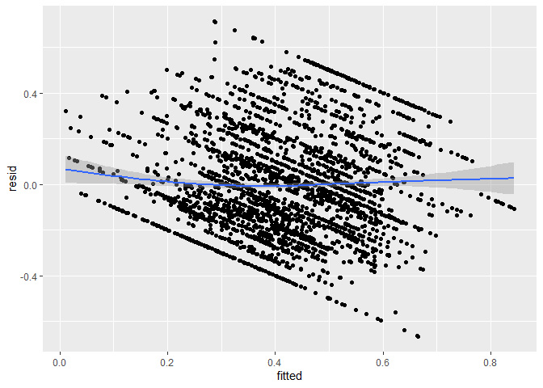
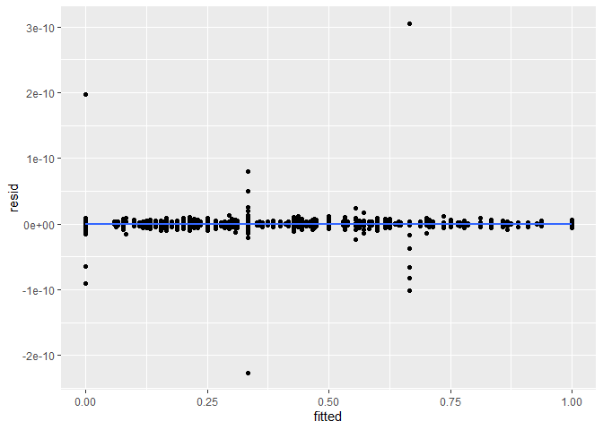

Linear Regression with Homoscedasticity
================
Angela Zhao
2020-10-27

  - [Reading and cleaning Data](#reading-and-cleaning-data)
      - [Adding in yes\_rate,
        match\_rate](#adding-in-yes_rate-match_rate)
  - [Normalize the preferences, if out of 100, to percentages
    instead.](#normalize-the-preferences-if-out-of-100-to-percentages-instead.)
  - [Choosing Variables](#choosing-variables)
  - [Rescaling 1-10 scale to 0-1
    scale](#rescaling-1-10-scale-to-0-1-scale)
  - [Create a train and a validate
    set](#create-a-train-and-a-validate-set)
  - [Functions](#functions)
      - [Checking Homoscedasticity](#checking-homoscedasticity)
  - [Linear Regression](#linear-regression)
      - [Modeling](#modeling)
  - [With no interaction terms](#with-no-interaction-terms)
  - [With interaction terms](#with-interaction-terms)
      - [Making m2 with only non-collinear
        covariates](#making-m2-with-only-non-collinear-covariates)
      - [Creating new dataset to spread new
        covariates](#creating-new-dataset-to-spread-new-covariates)
  - [Running the model with ind vars](#running-the-model-with-ind-vars)
      - [Attempt to run CV](#attempt-to-run-cv)

``` r
# Libraries
library(tidyverse)
library(here)
library(cvTools)
library(coefplot)
library(caret)

file_raw_train_data <-
  here("data/train_data_speed_dating.csv")

recode_race <-
  c(
    "1" = "Black", 
    "2" = "White", 
    "3" = "Hispanic", 
    "4" = "API", 
    "5" = "Indigenous",
    "6" = "Other"
  )
  
  
recode_field <-
  c(
    "1" = 'Law',   
    "2" = "Math",
    "3" = "Social_Science", 
    "4" = "Medical_Science",
    "5" = "Engineering",
    "6" = "English",
    "7" = "History_Religion_Philosophy",
    "8" = "Business_Econ_Finance",
    "9" = "Education_Academia",
    "10" = "Bio_Chem_Physics",
    "11" = "Social_Work", 
    "12" = "Undergrad_undecided",
    "13" = "PoliSci",
    "14" = "Film",
    "15" = "Art",
    "16" = "Languages",
    "17" = "Architecture",
    "18" = "Other"
  )
  
  
recode_career <-
  c(
    "1" = 'Lawyer',   
    "2" = "Academic_Research",
    "3" = "Psychologist", 
    "4" = "Doctor_Medicine",
    "5" = "Engineer",
    "6" = "Creative Arts_Entertainment",
    "7" = "Banking_Consulting_Finance_Marketing_Business_CEO_Entrepreneur_Admin",
    "8" = "Real Estate",
    "9" = "International_Humanitarian Affairs",
    "10" = "Undecided",
    "11" = "Social Work", 
    "12" = "Speech Pathology",
    "13" = "Politics",
    "14" = "Pro sports_Athletics",
    "15" = "Other",
    "16" = "Journalism",
    "17" = "Architecture"
  )
  

  
recode_goal <-
  c(
    "1" = 'Seemed like a fun night out',   
    "2" = "To meet new people",
    "3" = "To get a date", 
    "4" = "Looking for a serious relationship",
    "5" = "To say I did it",
    "6" = "Other"
  )


recode_date <- c(
  "1" = 'Several times a week',   
  "2" = "Twice a week",
  "3" = "Once a week", 
  "4" = "Twice a month",
  "5" = "Once a month",
  "6" = "Several times a year",
  "7" = "Almost never"
)


recode_go_out <-
  c(
    "1" = 'Several times a week',   
    "2" = "Twice a week",
    "3" = "Once a week", 
    "4" = "Twice a month",
    "5" = "Once a month",
    "6" = "Several times a year",
    "7" = "Almost never"
    
  )
```

## Reading and cleaning Data

``` r
train <-
  file_raw_train_data %>% 
  read_csv()
```

    ## 
    ## -- Column specification --------------------------------------------------------
    ## cols(
    ##   .default = col_double(),
    ##   positin1 = col_logical(),
    ##   field = col_character(),
    ##   undergra = col_logical(),
    ##   mn_sat = col_logical(),
    ##   tuition = col_logical(),
    ##   from = col_character(),
    ##   career = col_character(),
    ##   attr4_1 = col_logical(),
    ##   sinc4_1 = col_logical(),
    ##   intel4_1 = col_logical(),
    ##   fun4_1 = col_logical(),
    ##   amb4_1 = col_logical(),
    ##   shar4_1 = col_logical(),
    ##   attr5_1 = col_logical(),
    ##   sinc5_1 = col_logical(),
    ##   intel5_1 = col_logical(),
    ##   fun5_1 = col_logical(),
    ##   amb5_1 = col_logical(),
    ##   attr1_s = col_logical(),
    ##   sinc1_s = col_logical()
    ##   # ... with 56 more columns
    ## )
    ## i Use `spec()` for the full column specifications.

``` r
# Added in the ratings of partner rating you and you rating the partner
# diff is the avg of partner rating you - avg of you rating the partner

train <-
  train %>% 
  mutate_at(
    vars(
      career_c, 
      field_cd,
      race,
      race_o,
      zipcode,
      go_out,
      date,
      goal,
      met,
      met_o,
      samerace,
      gender,
      match
    ), 
    as.character
  ) %>% 
  mutate(
    career_c = recode(career_c, !!! recode_career), 
    field_cd = recode(field_cd, !!! recode_field), 
    race = recode(race, !!! recode_race), 
    field = str_to_lower(field), 
    career = str_to_lower(career),
    go_out = recode(go_out, !!! recode_go_out), 
    date = recode(date, !!! recode_date), 
    goal = recode(goal, !!! recode_goal),
    met = if_else(met == "2", "0", met), 
    met_o = if_else(met_o == "2", "0", met_o),
    race_o = recode(race_o, !!! recode_race), 
    gender = if_else(gender == "0", "female", "male"),
  ) %>%
  mutate_at(
    vars(
      career_c,
      field_cd,
      race,
      race_o,
      zipcode,
      go_out,
      date,
      goal,
      met,
      met_o,
      samerace,
      gender,
      match
    ),
    as.factor
  )
```

### Adding in yes\_rate, match\_rate

``` r
 ppl_all_in <-
  train %>%
  count(iid, dec) %>% 
  count(iid) %>% 
  filter(n == 1) %>% 
  pull(iid)
  
all_in <-
  train %>% 
  filter(iid %in% ppl_all_in) %>% 
  count(iid, dec) %>% 
  group_by(iid) %>% 
  mutate(
    yes_rate = as.double(if_else(dec == 1, 1, 0))
  ) %>% 
  dplyr::select(iid, yes_rate)

 yes_and_no <-
   train %>%
   filter(!(iid %in% ppl_all_in)) %>% 
   count(iid, dec) %>% 
   group_by(iid) %>% 
   mutate(
     reject_rate = n / sum(n), 
     yes_rate = 1 - reject_rate
   ) %>% 
   filter(dec == 0) %>% 
  dplyr::select(iid, yes_rate)
 
yes_rate <-
  yes_and_no %>% 
  bind_rows(all_in)

train  <-
  train %>% 
  left_join(
    yes_rate, 
    by = "iid"
  )
```

## Normalize the preferences, if out of 100, to percentages instead.

``` r
train <-
  train %>% 
  rowwise() %>% 
  mutate(
    rating = sum(c(attr, sinc, intel, fun, amb, shar)), 
    avg_partner_rating = 
      mean(c(attr, sinc, intel, fun, amb, shar), na.rm = TRUE) / 10
  ) %>%
  mutate_at(
    vars(attr, sinc, intel, fun, amb, shar), 
    ~ . / rating
  ) %>% 
  select(-rating)
```

## Choosing Variables

``` r
# Selecting only the variables that determine perception of the round of speed

# Field and career are too unevenly entered, so best to use the coded versions instead. 

vars_wanted <-
  train %>% 
  select(
    rowname, 
    gender, 
    condtn, 
    match:race_o,
    like_o:age, 
    field_cd, 
    race:imprelig, 
    goal:go_out, 
    career_c:exphappy, 
    dec:met, 
    yes_rate,
    avg_partner_rating
  ) %>%
  select(-c(met, met_o)) %>% 
  summarize_all(~ sum(is.na(.))) %>% 
  summarize_all(~ sum(.)) %>% 
  mutate_all(~ . / 4258) %>% 
  pivot_longer(
    cols = everything(), 
    names_to = "var", 
    values_to = "percent_missing"
  ) %>% 
  filter(percent_missing < 0.5) 

vars_wanted <-
  vars_wanted %>% 
  arrange(desc(percent_missing)) %>% 
  filter(var != "income") %>% 
  pull(var)

all_training_data <-
  train %>% 
  select(rowname, all_of(vars_wanted))
```

## Rescaling 1-10 scale to 0-1 scale

``` r
all_training_data <-
  all_training_data %>% 
  mutate_at(vars(prob, prob_o, like, like_o, imprace, imprelig, sports:exphappy), 
            ~ . / 10
  ) %>% 
  mutate_at(vars(match), as.double) 
```

## Create a train and a validate set

``` r
random_rows <-
  all_training_data %>%
  pull(rowname) %>% 
  as_tibble %>% 
  sample_frac(0.8) %>% 
  mutate(
    value = as.character(value)
  ) %>% 
  pull(value)

train_model_data <-
  all_training_data %>%
  as_tibble() %>% 
  filter(rowname %in% random_rows)

test_model_data <-
  all_training_data %>%
  anti_join(train_model_data, by = "rowname") %>% 
  select(-rowname)
```

## Functions

### Checking Homoscedasticity

``` r
res_vs_fitted <- function(model) {
  residuals({{model}}) %>% 
    unname() %>% 
    as_tibble() %>% 
    bind_cols(
      fitted({{model}}) %>% unname()
    ) %>% 
    dplyr::rename(resid = 1, fitted = 2) %>% 
    ggplot(aes(fitted, resid)) +
    geom_point() +
    geom_smooth()
}
```

## Linear Regression

### Modeling

``` r
train_model_data_3 <-
  train_model_data %>% 
  select(
    yes_rate, 
    field_cd, 
    race, 
    race_o, 
    condtn,
    sinc, 
    shar, 
    int_corr, 
    like, 
    imprace, 
    imprelig, 
    clubbing, 
    reading, 
    tv, 
    theater, 
    movies, 
    concerts, 
    music, 
    shopping, 
    yoga, 
    exphappy, 
    age
  )
```

## With no interaction terms

``` r
m1 <-
  lm(
    yes_rate ~ ., 
    data = 
      train_model_data_3
  )

res_vs_fitted(m1)
```

    ## New names:
    ## * NA -> ...2

    ## `geom_smooth()` using method = 'gam' and formula 'y ~ s(x, bs = "cs")'

<!-- -->

## With interaction terms

``` r
m2 <-
  lm(
    yes_rate ~ . + .:., 
    data = 
      train_model_data_3
  )

res_vs_fitted(m2)
```

    ## New names:
    ## * NA -> ...2

    ## `geom_smooth()` using method = 'gam' and formula 'y ~ s(x, bs = "cs")'

<!-- -->

### Making m2 with only non-collinear covariates

``` r
## Pulling only non-collinear covars

length(m2$coefficients) > m2$rank
```

    ## [1] TRUE

``` r
x <-
  alias(m2)


ind_covars_m2 <-
  x$Complete %>% 
  as.data.frame() %>% 
  names() %>% 
  as_tibble() %>% 
  slice(-1) %>% 
  pull(value)

formula_wanted <-
  str_c("yes_rate ~ ", str_c(ind_covars_m2, collapse = " + "))
```

### Creating new dataset to spread new covariates

``` r
train_model_data_4 <-
  model.matrix(yes_rate ~ ., train_model_data_3 %>% drop_na()) %>% 
  as.data.frame() %>% 
  bind_cols(train_model_data_3 %>% drop_na() %>% select(yes_rate))
```

## Running the model with ind vars

``` r
m2_ind <-
  lm(
   formula_wanted, 
    data = train_model_data_4
  )


res_vs_fitted(m2_ind)
```

    ## New names:
    ## * NA -> ...2

    ## `geom_smooth()` using method = 'gam' and formula 'y ~ s(x, bs = "cs")'

<!-- -->
\#\# RMSE and R squared on training and test data

``` r
predictions <- m2_ind %>% predict(train_model_data_4)

rsquared_rmse_in_sample <-
  tibble(
    R2 = R2(predictions, train_model_data_4$yes_rate), 
    RMSE = RMSE(predictions, train_model_data_4$yes_rate)
  )


rsquared_rmse_in_sample
```

    ## # A tibble: 1 x 2
    ##      R2     RMSE
    ##   <dbl>    <dbl>
    ## 1  1.00 1.28e-11

``` r
test_model_data_4 <-
  model.matrix(yes_rate ~ ., test_model_data %>% drop_na()) %>% 
  as.data.frame() %>% 
  bind_cols(test_model_data %>% drop_na() %>% select(yes_rate))

predictions <- m2_ind %>% predict(test_model_data_4)

rsquared_rmse_validation_data <-
  tibble(
    R2 = R2(predictions, test_model_data_4$yes_rate), 
    RMSE = RMSE(predictions, test_model_data_4$yes_rate)
  )

rsquared_rmse_validation_data
```

    ## # A tibble: 1 x 2
    ##      R2  RMSE
    ##   <dbl> <dbl>
    ## 1 0.242 0.447

### Attempt to run CV

``` r
train.control <- trainControl(method = "cv", number = 10)
# Train the model
model <- train(as.formula(formula_wanted), data = train_model_data_4, method = "lm",
               trControl = train.control)
```

    ## Warning in predict.lm(modelFit, newdata): prediction from a rank-deficient fit
    ## may be misleading
    
    ## Warning in predict.lm(modelFit, newdata): prediction from a rank-deficient fit
    ## may be misleading
    
    ## Warning in predict.lm(modelFit, newdata): prediction from a rank-deficient fit
    ## may be misleading
    
    ## Warning in predict.lm(modelFit, newdata): prediction from a rank-deficient fit
    ## may be misleading
    
    ## Warning in predict.lm(modelFit, newdata): prediction from a rank-deficient fit
    ## may be misleading
    
    ## Warning in predict.lm(modelFit, newdata): prediction from a rank-deficient fit
    ## may be misleading
    
    ## Warning in predict.lm(modelFit, newdata): prediction from a rank-deficient fit
    ## may be misleading
    
    ## Warning in predict.lm(modelFit, newdata): prediction from a rank-deficient fit
    ## may be misleading
    
    ## Warning in predict.lm(modelFit, newdata): prediction from a rank-deficient fit
    ## may be misleading

``` r
# Summarize the results
print(model)
```

    ## Linear Regression 
    ## 
    ## 2778 samples
    ##   41 predictor
    ## 
    ## No pre-processing
    ## Resampling: Cross-Validated (10 fold) 
    ## Summary of sample sizes: 2498, 2500, 2501, 2501, 2500, 2501, ... 
    ## Resampling results:
    ## 
    ##   RMSE      Rsquared   MAE     
    ##   36.99125  0.4381339  2.413142
    ## 
    ## Tuning parameter 'intercept' was held constant at a value of TRUE
