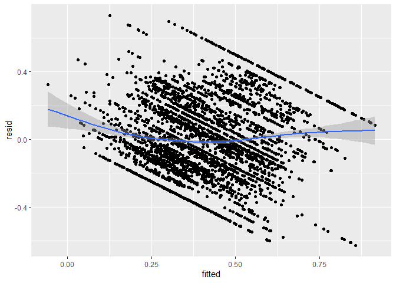
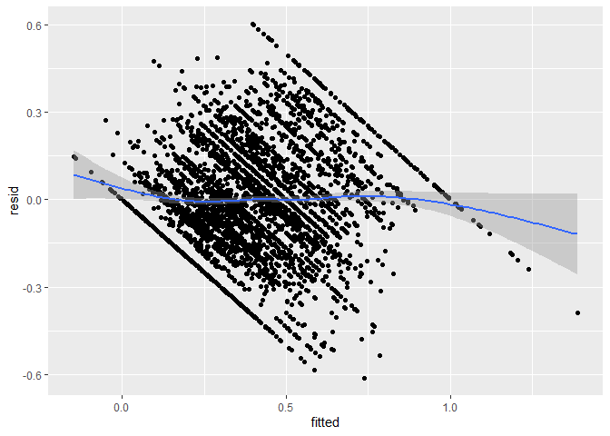

Linear Regression w/o Homoscedasticity
================
Angela Zhao
2020-10-27

  - [Reading and cleaning Data](#reading-and-cleaning-data)
      - [Adding in yes\_rate,
        match\_rate](#adding-in-yes_rate-match_rate)
  - [Normalize the preferences, if out of 100, to percentages
    instead.](#normalize-the-preferences-if-out-of-100-to-percentages-instead.)
  - [Choosing Variables](#choosing-variables)
  - [Rescaling 1-10 scale to 0-1
    scale](#rescaling-1-10-scale-to-0-1-scale)
  - [Create a train and a validate
    set](#create-a-train-and-a-validate-set)
  - [Using lasso to weed out extraneous
    vars](#using-lasso-to-weed-out-extraneous-vars)
      - [Checking Homoscedasticity](#checking-homoscedasticity)
      - [Calculating RMSE w/ CV](#calculating-rmse-w-cv)
  - [Linear Regression](#linear-regression)
      - [With all lasso covariates](#with-all-lasso-covariates)
  - [Interaction terms](#interaction-terms)
  - [Independent interactions only](#independent-interactions-only)
  - [Other models that are not pure
    interaction](#other-models-that-are-not-pure-interaction)

``` r
# Libraries
library(tidyverse)
library(here)
library(cvTools)
library(coefplot)
library(glmnet)
library(caret)

file_raw_train_data <-
  here("data/train_data_speed_dating.csv")

recode_race <-
  c(
    "1" = "Black", 
    "2" = "White", 
    "3" = "Hispanic", 
    "4" = "API", 
    "5" = "Indigenous",
    "6" = "Other"
  )


recode_goal <-
  c(
    "1" = 'Seemed_like_a_fun_night_out',   
    "2" = "To_meet_new_people",
    "3" = "To_get_a_date", 
    "4" = "Looking_for_a_serious_relationship",
    "5" = "To say I did it",
    "6" = "Other"
  )
```

## Reading and cleaning Data

``` r
train <-
  file_raw_train_data %>% 
  read_csv()
```

    ## 
    ## -- Column specification --------------------------------------------------------
    ## cols(
    ##   .default = col_double(),
    ##   positin1 = col_logical(),
    ##   field = col_character(),
    ##   undergra = col_logical(),
    ##   mn_sat = col_logical(),
    ##   tuition = col_logical(),
    ##   from = col_character(),
    ##   career = col_character(),
    ##   attr4_1 = col_logical(),
    ##   sinc4_1 = col_logical(),
    ##   intel4_1 = col_logical(),
    ##   fun4_1 = col_logical(),
    ##   amb4_1 = col_logical(),
    ##   shar4_1 = col_logical(),
    ##   attr5_1 = col_logical(),
    ##   sinc5_1 = col_logical(),
    ##   intel5_1 = col_logical(),
    ##   fun5_1 = col_logical(),
    ##   amb5_1 = col_logical(),
    ##   attr1_s = col_logical(),
    ##   sinc1_s = col_logical()
    ##   # ... with 56 more columns
    ## )
    ## i Use `spec()` for the full column specifications.

``` r
# Added in the ratings of partner rating you and you rating the partner
# diff is the avg of partner rating you - avg of you rating the partner

train <-
  train %>% 
  mutate_at(
    vars(
      career_c, 
      field_cd,
      race,
      race_o,
      zipcode,
      go_out,
      date,
      goal,
      met,
      met_o,
      samerace,
      gender,
      match
    ), 
    as.character
  ) %>% 
  mutate(
    field_cd = 
      case_when(
        field_cd %in% c("2", "4", "5", "10") ~ "STEM", 
        field_cd %in% c("1", "3", "8", "9", "11", "13") ~ "Social_Science",
        field_cd %in% c("6", "7", "14", "15", "16", "17") ~ "Humanities",
        TRUE ~ "Other"
      ), 
    race = recode(race, !!! recode_race), 
    goal = recode(goal, !!! recode_goal),
    met = if_else(met == "2", "0", met), 
    met_o = if_else(met_o == "2", "0", met_o),
    race_o = recode(race_o, !!! recode_race), 
    gender = if_else(gender == "0", "female", "male"),
    career_c = 
      case_when(
        career_c %in% c("3", "4", "5") ~ "STEM", 
        career_c %in% c("1", "7", "8", "9", "10", "11", "12", "13", "17") ~ "Social_Science",
        career_c %in% c("6") ~ "Humanities",
        TRUE ~ "Other"
      )
  ) %>%
  mutate_at(
    vars(
      career_c,
      field_cd,
      race,
      race_o,
      goal,
      met,
      met_o,
      gender
    ),
    as.factor
  )
```

### Adding in yes\_rate, match\_rate

``` r
 ppl_all_in <-
  train %>%
  count(iid, dec) %>% 
  count(iid) %>% 
  filter(n == 1) %>% 
  pull(iid)
  
all_in <-
  train %>% 
  filter(iid %in% ppl_all_in) %>% 
  count(iid, dec) %>% 
  group_by(iid) %>% 
  mutate(
    yes_rate = as.double(if_else(dec == 1, 1, 0))
  ) %>% 
  dplyr::select(iid, yes_rate)

 yes_and_no <-
   train %>%
   filter(!(iid %in% ppl_all_in)) %>% 
   count(iid, dec) %>% 
   group_by(iid) %>% 
   mutate(
     reject_rate = n / sum(n), 
     yes_rate = 1 - reject_rate
   ) %>% 
   filter(dec == 0) %>% 
  dplyr::select(iid, yes_rate)
 
yes_rate <-
  yes_and_no %>% 
  bind_rows(all_in)

train  <-
  train %>% 
  left_join(
    yes_rate, 
    by = "iid"
  )
```

## Normalize the preferences, if out of 100, to percentages instead.

``` r
train <-
  train %>% 
  rowwise() %>% 
  mutate(
    rating = sum(c(attr, sinc, intel, fun, amb, shar)), 
    avg_partner_rating = 
      mean(c(attr, sinc, intel, fun, amb, shar), na.rm = TRUE) / 10
  ) %>%
  mutate_at(
    vars(attr, sinc, intel, fun, amb, shar), 
    ~ . / rating
  ) %>% 
  select(-rating)
```

## Choosing Variables

``` r
# Selecting only the variables that determine perception of the round of speed

# Field and career are too unevenly entered, so best to use the coded versions instead. 

vars_wanted <-
  train %>% 
  select(
    rowname, 
    gender, 
    condtn, 
    match:race_o,
    like_o:age, 
    field_cd, 
    race:imprelig, 
    goal:go_out, 
    career_c:exphappy, 
    dec:met, 
    yes_rate,
    avg_partner_rating
  ) %>%
  select(-c(met, met_o, go_out, date, career_c)) %>% 
  summarize_all(~ sum(is.na(.))) %>% 
  summarize_all(~ sum(.)) %>% 
  mutate_all(~ . / 4258) %>% 
  pivot_longer(
    cols = everything(), 
    names_to = "var", 
    values_to = "percent_missing"
  ) %>% 
  filter(percent_missing < 0.5) 

vars_wanted <-
  vars_wanted %>% 
  arrange(desc(percent_missing)) %>% 
  filter(var != "income") %>% 
  pull(var)

all_training_data <-
  train %>% 
  select(rowname, all_of(vars_wanted))
```

## Rescaling 1-10 scale to 0-1 scale

``` r
all_training_data <-
  all_training_data %>% 
  mutate_at(vars(prob, prob_o, like, like_o, imprace, imprelig, sports:exphappy), 
            ~ . / 10
  )

all_training_data_orig <-
  all_training_data
```

## Create a train and a validate set

``` r
lasso_model_data <- 
  all_training_data %>% 
  select(-c(rowname, dec, match)) %>% 
  mutate_at(vars(condtn), as.factor) %>%
  select(-c(sports:yoga, condtn, field_cd)) %>% 
  drop_na()
```

## Using lasso to weed out extraneous vars

``` r
# convert the data to a design matrix
X = model.matrix(yes_rate ~ 0 + ., lasso_model_data)
Y = lasso_model_data %>% pull(yes_rate)


# standardize
X = scale(X)
Y = scale(Y)

set.seed(1244)

# create training and test set
train.ind = sample(nrow(X), round(nrow(X)/2))
X.train = X[train.ind,]
X.test = X[-train.ind,]
Y.train = Y[train.ind]
Y.test = Y[-train.ind]

# set lambda sequence to use for lasso and ridge
lambdas = 10^seq(-2,1.5,0.1)

#lasso
fm.lasso = glmnet(X.train, Y.train, alpha = 1, lambda = lambdas, thresh = 1e-12)

fm.lasso %>%
  summary()
```

    ##           Length Class     Mode   
    ## a0          36   -none-    numeric
    ## beta      1188   dgCMatrix S4     
    ## df          36   -none-    numeric
    ## dim          2   -none-    numeric
    ## lambda      36   -none-    numeric
    ## dev.ratio   36   -none-    numeric
    ## nulldev      1   -none-    numeric
    ## npasses      1   -none-    numeric
    ## jerr         1   -none-    numeric
    ## offset       1   -none-    logical
    ## call         6   -none-    call   
    ## nobs         1   -none-    numeric

``` r
cv <- cv.glmnet(X.train, Y.train)

cv$lambda.min
```

    ## [1] 0.009310549

``` r
covars_wanted <-
  extract.coef(cv) %>%
  select(coeff = Coefficient) %>%
  filter(coeff != "(Intercept)") %>%
  pull(coeff)

train_model_data <-
  X %>% 
  as.data.frame() %>% 
  select(all_of(covars_wanted)) %>% 
  bind_cols(lasso_model_data %>% select(yes_rate))
```

### Checking Homoscedasticity

``` r
res_vs_fitted <- function(model) {
  residuals({{model}}) %>% 
    unname() %>% 
    as_tibble() %>% 
    bind_cols(
      fitted({{model}}) %>% unname()
    ) %>% 
    dplyr::rename(resid = 1, fitted = 2) %>% 
    ggplot(aes(fitted, resid)) +
    geom_point() +
    geom_smooth()
}
```

### Calculating RMSE w/ CV

``` r
cv_rmse_train <- function(model) {
  cvFit(
    {{model}}, 
    data = train_model_data, 
    y = train_model_data %>% pull(yes_rate), 
    K = 10, 
    seed = 1
  )
}
```

## Linear Regression

### With all lasso covariates

``` r
lin_reg_all <-
  lm(
    yes_rate ~ ., 
    data = train_model_data
  ) 

res_vs_fitted(lin_reg_all)
```

    ## New names:
    ## * NA -> ...2

    ## `geom_smooth()` using method = 'gam' and formula 'y ~ s(x, bs = "cs")'

<!-- -->

``` r
cv_rmse_train(lin_reg_all)
```

    ## 10-fold CV results:
    ##        CV 
    ## 0.2209732

``` r
summary(lin_reg_all)$r.squared
```

    ## [1] 0.2980966

``` r
predictions <- lin_reg_all %>% predict(train_model_data)

rsquared_rmse_in_sample <-
  tibble(
    R2 = R2(predictions, train_model_data$yes_rate), 
    RMSE = RMSE(predictions, train_model_data$yes_rate)
  )
```

## Interaction terms

``` r
# Rank is too high to be useful, so manually cut down on variables

m2 <-
  lm(
    yes_rate ~ . + .:., 
    data = train_model_data
    
  ) 

summary(m2)$r.squared
```

    ## [1] 0.4978131

``` r
res_vs_fitted(m2)
```

    ## New names:
    ## * NA -> ...2

    ## `geom_smooth()` using method = 'gam' and formula 'y ~ s(x, bs = "cs")'

<!-- -->

``` r
# Rank deficient fit
cv_rmse_train(m2)
```

    ## Warning in predict.lm(...): prediction from a rank-deficient fit may be
    ## misleading
    
    ## Warning in predict.lm(...): prediction from a rank-deficient fit may be
    ## misleading
    
    ## Warning in predict.lm(...): prediction from a rank-deficient fit may be
    ## misleading
    
    ## Warning in predict.lm(...): prediction from a rank-deficient fit may be
    ## misleading
    
    ## Warning in predict.lm(...): prediction from a rank-deficient fit may be
    ## misleading
    
    ## Warning in predict.lm(...): prediction from a rank-deficient fit may be
    ## misleading
    
    ## Warning in predict.lm(...): prediction from a rank-deficient fit may be
    ## misleading
    
    ## Warning in predict.lm(...): prediction from a rank-deficient fit may be
    ## misleading
    
    ## Warning in predict.lm(...): prediction from a rank-deficient fit may be
    ## misleading
    
    ## Warning in predict.lm(...): prediction from a rank-deficient fit may be
    ## misleading

    ## 10-fold CV results:
    ##        CV 
    ## 0.2001844

## Independent interactions only

``` r
x <-
  alias(m2)


ind_covars_m2 <-
  x$Complete %>% 
  as.data.frame() %>% 
  names() %>% 
  as_tibble() %>% 
  slice(-1) %>% 
  pull(value)

m2_ind_formula <-
  str_c("yes_rate ~ ", str_c(ind_covars_m2, collapse = " + "))


m2_ind <-
  lm(
    m2_ind_formula, 
    data = train_model_data
  )

summary(m2_ind)$r.squared
```

    ## [1] 0.4978131

``` r
cv_rmse_train(m2_ind)
```

    ## 10-fold CV results:
    ##        CV 
    ## 0.2001844

## Other models that are not pure interaction

``` r
m3_vars <-
  car::vif(m2_ind) %>% 
  as.list() %>% 
  as_tibble() %>% 
  pivot_longer(
    cols = everything(),
    names_to = "var", 
    values_to = "coef"
  ) %>% 
  arrange(desc(coef)) %>% 
  filter(coef < 7) %>% 
  pull(var)


m3_formula <-
  str_c("yes_rate ~ ", str_c(m3_vars, collapse = " + "))

m3 <-
  lm(
    m3_formula,
    data = train_model_data
  )

#res_vs_fitted(m3)
summary(m3)$r.squared
```

    ## [1] 0.482949

``` r
cv_rmse_train(m3)
```

    ## 10-fold CV results:
    ##        CV 
    ## 0.2023558
